# Rushes：Chat-first 本地剪辑 Agent — PRD 与实现契约

版本：v1.5（全量自含）
日期：2026-07-06

**变更历史**（每版一行要点；详尽评审记录见 git 历史）：

| 版本 | 变更要点 |
|---|---|
| v1.5 | 文档清理：更名 PRD.md、收敛变更记录、修复交叉引用与残留措辞，无契约语义变更。 |
| v1.4 | Spec C（agentic 素材理解）：删离线标注与检索基建（annotation 流水线、FTS5/embedding/RRF/CandidatePack、embedding.text provider）；新增 `understand.materials` 在 turn 内同步派理解子代理产出带秒级时间戳的 MaterialSummary；选材主路径改为主代理读摘要 + `timeline.compose_initial` 直接组装；硬约束由「标注失败素材不能参与剪辑」放宽为「理解失败可重试或经用户知情后绕过」；worker 并发升为小池。 |
| v1.3 | TTS provider 定稿：由「MiniMax 默认、火山备选」改为**火山引擎唯一**（用户 2026-07-05 决策，全文 MiniMax 引用同步替换）。 |
| v1.2 | cut_plan 生产者硬契约（§6.5）；PatchOpSpec 注册表承担 op 级 human gate（§16.1）；TimelinePatch 拆 Request/Resolved 两阶段消除「禁裸秒」与 schema 的冲突（§7.8）；补 validator 素材存活不变量（§10.2）。（其中候选包相关约束已于 v1.4 随检索基建移除。） |

目标读者：直接执行 `/goal` 的 coding agent、人类开发者、后续维护者
项目形态：个人本地开源项目，垂直视频剪辑 Agent
技术选型依据：`research/` 目录下四份联网技术调研（2026-07）

本文档经过多轮独立交叉评审（Claude 修订 × Codex 只读评审的七轮对抗迭代，最终评审结论：P0/P1 级问题清零，可进入执行）。所有已知的契约矛盾、机制歧义与验收缺口均已修复并收敛于本版；本文档是唯一实现依据，无任何前置阅读要求。

## 硬约束（全文档最高优先级）

只使用用户上传、本地导入、用户显式提供链接的素材；不做在线素材搜索；不做团队协作、鉴权、多设备同步；不做 AI 转场；只导出 MP4；理解失败素材需重试或经用户知情后绕过（不再有「不能参与剪辑」硬门）；字幕、BGM、最终导出、长期记忆沉淀必须 human-in-loop；预览可低画质，最终导出高画质；所有数据在本地 workspace。

## 0. 如何用这份文档执行 `/goal`

这不是传统 PRD，是面向 coding agent 的实现契约。剪辑能力不是固定 DAG，而是 Agent 主循环每轮：读取状态 → 组装上下文 → 选择工具 → 执行 → 归约状态 → 必要时询问用户。

**实现优先级三条：**

1. 先做可控循环，再做智能能力。没有 ToolRegistry、PolicyGate、Reducer、Validator、AgentTrace，不允许 LLM 调用任何媒体工具。
2. Project 和 Case 是用户在文件树中直接操作的一等对象；Asset 和 Memory 是后台资源。每次明确的新剪辑任务默认创建一个 Case。
3. 工具可用性由 **CaseState 的 artifact 存在性和 decision 状态** 决定（§5.2 前置条件表），不由流程模板决定。

**阅读地图：**

| 你要做什么 | 读哪里 |
|---|---|
| 理解产品与界面 | §1–§2 |
| 建库表 / 定义 schema | §3（ER 图）+ §7（数据契约） |
| 写 harness 主循环 | §4 + §5 |
| 写某个工具 | §6（清单）+ §16.1（ToolSpec）+ 对应领域章（§8–§11） |
| 接一个新 provider | §16.2 + §9（ASR/TTS 要求） |
| 写渲染 | §10 |
| 写前端 | §2 + §13 + §14.4 |
| 排期与验收 | §17 + §19 |

## 1. 产品心智

本项目是一个本地运行的垂直剪辑 Agent（竖屏 9:16 短视频为主，时长 ≤ 2 分钟）。用户先创建 Project 并导入素材；每次发起剪辑任务新建一个 Case。Case 类似 Codex / Claude Code 的一次工作会话：包含对话、目标、素材限制、内容计划、音频策略、素材理解摘要、时间线版本、预览、导出和临时上下文。

一个 Project 可以有很多 Case。Project 内 Case 共享 Project 素材池和 Project 级记忆；User 级记忆跨 Project 复用；保存记忆必须询问作用域。无登录、无云同步、无团队协作。

用户体验接近 Codex / Claude Code 而不是传统剪辑软件：

- 用户说"帮我剪一条小红书种草视频"→ Agent 判断缺什么上下文 → 结构化提问 → 派子代理理解素材（读摘要）→ 规划时间线 → 渲染预览。
- 用户说"7 秒那段删掉""开头换产品特写""字幕不要了"→ Agent 转成受控 TimelinePatch → 重新验证和渲染。
- 所有破坏性、外发性、審美性的决定（删除、导出、字幕、BGM、记忆）都有 human gate。

## 2. 顶层界面

剪映式两态壳（深色剪辑器视觉，设计令牌集中于 `apps/web/src/index.css`）：**首页**（项目卡片墙）与 **Case 工作台**（全屏三区）。没有常驻文件树、没有常驻侧边素材栏；顶部只保留极简栏——首页：应用名 / 本地连接状态 / 设置；工作台：返回 + 项目名 / Case 名（可改名）+ 导出 + 连接状态 / 设置。不得把 workflow stage、素材数量长期放顶部。

```text
态一 · 首页 /                          态二 · Case 工作台（全屏）
┌──────────────────────────┐  ┌─────────────────────────────────────┐
│ Rushes      ● 已连接 设置 │  │ ⌂ 项目A / Case001 ✎  导出 ● 设置    │
├──────────────────────────┤  ├────────────┬──────────┬─────────────┤
│ [＋新建项目]              │  │            │ 素材面板  │ 预览播放器   │
│ ┌────┐ ┌────┐ ┌────┐     │  │  剪辑对话   │(文件夹分组)│ (9:16 黑底) │
│ │项目A│ │项目B│ │项目C│   │  │  (可拖宽)   ├──────────┴─────────────┤
│ └────┘ └────┘ └────┘     │  │            │ 时间线（只读通栏，可拖高）│
│ 点开项目卡 → 项目详情页    │  └────────────┴────────────────────────┘
└──────────────────────────┘
```

项目详情页 `/projects/:projectId` 是首页与工作台之间的中间层：顶栏返回 + 项目名，主体三个 tab——剪辑任务（新建 Case 输入 + Case 卡片列表）、素材（素材面板管理模式）、设置（成本汇总占位 + 项目重命名/复制/删除）。

### 2.1 页面选择规则

| 页面 | 内容 | 路由 |
|---|---|---|
| 首页 | 项目卡片墙 + 新建项目 | `/` |
| 项目详情 | 剪辑任务 / 素材 / 设置 三 tab（`?tab=`） | `/projects/:projectId` |
| 旧素材页路由 | 重定向到项目详情素材 tab | `/projects/:projectId/materials` |
| Case 工作台 | 剪辑对话 + 素材面板 + 预览 + 时间线 | `/projects/:projectId/cases/:caseId` |

Assets、Memories、Exports 是数据库对象，不设独立导航层级。Case ID 数据库内全局唯一，但路由保留 Project 上下文，使面包屑和数据查询作用域一致。

### 2.2 用户可见操作

- **Project**：创建、重命名、复制、删除（软删除，须确认）、打开、进素材管理、创建 Case、打开设置。
- **Case**：创建、重命名、复制、删除（须确认）、移动到其他 Project（须确认 + 处理素材链接）、打开、关闭、恢复历史 timeline 版本、查看时间线结构、导出 MP4。
- **Asset**（素材面板：项目详情素材 tab 与 Case 工作台共用）：**原生导入，原地索引优先**——「＋ 导入素材」/「导入文件夹」经后端弹出 macOS 原生选择框（§13.4 fs/pick）拿绝对路径，走 import-local **reference 模式零拷贝导入**，文件夹层级存 `rel_dir` 分组；非 macOS/无 GUI 回退浏览器选择器（分片上传 copy）。拖拽文件/文件夹进面板受浏览器沙箱限制走分片上传（copy），层级同样保留。删除 Project 引用、禁用、失效重新定位、查看缩略图/时长/理解摘要。UI 不设 URL 导入入口（走对话由 agent 调 `asset.import_url`，确认卡在对话流呈现）。理解的触发与重试都在对话里由 agent 调 `understand.materials` 完成，素材面板不设手动"理解/重试"按钮（chat-first）。

这些操作可从 UI 直接触发；Project 与 Asset 操作、Case 的创建/移动/关闭也可由 Agent 调工具触发，但 **Case 的重命名/删除/复制仅限 UI/REST**（§6，Agent 无此工具）。**两条路径都产生 DomainEvent 走同一 Reducer**（§4.5），Agent 下一轮自然看到 UI 侧的变化。

### 2.3 项目详情页与素材面板

项目详情页三个 tab：剪辑任务（"描述你的新剪辑任务"输入 + Case 卡片列表，提交后必须先创建 Case 再跳转工作台；不允许 Project 级对话直接修改 timeline）、素材、设置。

素材面板是同一组件的两种模式：项目详情素材 tab 为**管理模式**（瓦片菜单：禁用/启用、删除引用、失效重新定位；点击瓦片展开理解摘要全文），Case 工作台右上为**试看模式**（点击素材在预览区试看）。面板为文件夹分组网格：文件夹瓦片 + 素材缩略图瓦片（时长角标、理解状态徽标 未理解/理解中/已理解/失败）、面包屑下钻。导入用**系统原生选择器或拖拽**（§13.4）：按钮入口经后端 fs/pick 弹 macOS 原生对话框拿绝对路径 → reference 零拷贝原地导入（不可用时回退浏览器选择器分片上传）；拖拽目录（webkitGetAsEntry 递归）拿不到磁盘路径，经分片上传 copy 入库，相对路径存为链接的 `rel_dir` 作分组依据。服务端目录浏览对话框仅保留给「重新定位失效素材」。理解不设任何手动按钮（含失败重试）：触发与重试都由用户在对话里表达、agent 调工具完成，UI 不加旁路入口。

### 2.4 Case 工作台（Agent Console）

所有剪辑对话发生在 Case 内。工作台为全屏三区：**左**剪辑对话——消息流（助手散文逐字流式 + 历史回放）、结构化交互事件、工具进度（turn 内每一步实时进入对话流成为过程条目，如"正在修改时间线…"→ ✓/✗）、当前确认项钉在输入框上方、输入框；宽度可拖拽。**右上**素材面板（试看模式）+ 预览播放器（9:16 黑底、帧步进）。**底部**通栏只读时间线：刻度尺、轨道色、clip 标签、播放头与预览双向联动、点击 seek、缩放/适应、版本下拉切换查看（恢复历史版本仍走对话，无 UI 旁路）。顶栏「导出」按钮以预填消息走对话链路触发导出确认。消息流数据源为 `GET /cases/{cid}/messages`（含 user/reply/narration 三类，见 §7.9）做历史回放，实时增量经 turn-stream SSE（§2.6）推送。组件映射见 §14.4。（Case 成本小计后续接入。）

### 2.5 新任务与 Case 创建

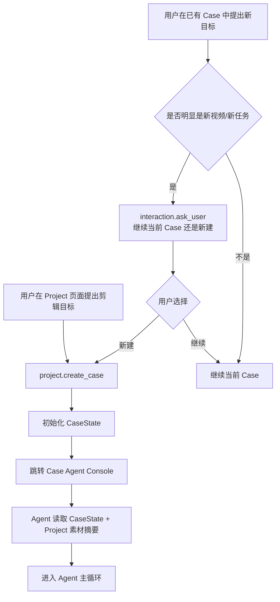

判断标准：用户只是修改当前视频（删段、换素材、改字幕）→ 继续；用户说"再剪一条""新做一个版本""换一条视频"→ 必须询问，避免污染当前 timeline。

### 2.6 结构化交互事件

`StructuredInteractionEvent` 是工具返回的前端可渲染结构（等价于 Codex / Claude Code 中的命令结果、diff、确认问题、计划、进度、预览块）。Agent 调 `interaction.ask_user` / `interaction.confirm_action` 创建 Decision 并返回结构化输出；前端按 schema 渲染按钮、选择器、输入框、预览视频或时间线摘要。用户可点按钮，也可自然语言回答，统一归约为 `DecisionAnswer`。前端用 assistant-ui 的 Tool UI / DataMessagePart 机制渲染，后端契约不感知组件库。

**过程可见性（两通道并存，职责分离）**：领域事件 SSE（event_log 尾随，§13.2）推送已落库的持久事实；turn-stream SSE（`GET /cases/{cid}/turn-stream`，进程内广播）推送本回合瞬态过程——`turn_started` / `text_delta {message_id, kind, delta}` / `message_completed {message_id}` / `tool_step_started` / `tool_step_finished {status}` / `turn_ended` / `turn_error`。助手散文逐字流式渲染"进行中"气泡（区分 narration 弱化样式与 reply 正常气泡），工具每步渲染为过程条目。连接时先回放当前进行中 turn 的缓冲快照再续实时增量；断线重连靠快照恢复，终态一致性由 messages 表与领域事件 SSE 兜底。

## 3. 信息模型与总体架构

### 3.1 总体架构图

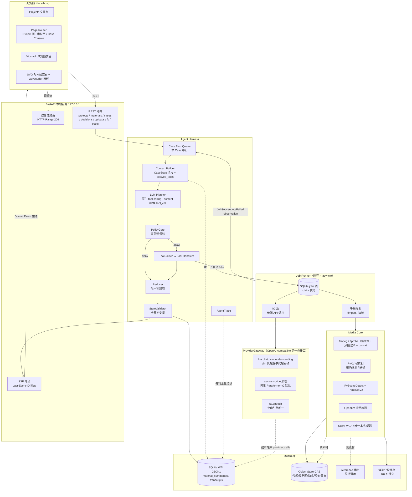

要点：Reducer 是**唯一写路径**；EventLog、SSE、AgentTrace 三者共享同一 DomainEvent 流；长任务全部走 Job Runner，完成后以 observation 回到 Turn Queue 触发下一轮。

### 3.2 数据库 ER 图

```mermaid
erDiagram
  PROJECTS ||--o{ CASES : "拥有"
  PROJECTS ||--o{ PROJECT_ASSET_LINKS : "链接素材"
  ASSETS ||--o{ PROJECT_ASSET_LINKS : "被链接"
  ASSETS ||--o{ MATERIAL_SUMMARIES : "理解摘要（多版本）"
  ASSETS ||--o{ TRANSCRIPTS : "ASR 转写"
  CASES ||--o{ MESSAGES : "对话"
  CASES ||--o{ DECISIONS : "case 级确认"
  PROJECTS ||--o{ DECISIONS : "project 级确认"
  CASES ||--o{ TIMELINE_VERSIONS : "时间线版本链"
  TIMELINE_VERSIONS ||--o{ PREVIEWS : "预览产物"
  TIMELINE_VERSIONS ||--o{ EXPORTS : "导出产物"
  CASES ||--o{ JOBS : "后台任务"
  ASSETS ||--o{ JOBS : "索引/代理任务"
  PROJECTS ||--o{ MEMORIES : "project 作用域"
  CASES ||--o{ MEMORY_CANDIDATES : "记忆候选"
  MEMORY_CANDIDATES ||--o| MEMORIES : "保存后"
  CASES ||--o{ AGENT_TRACES : "每轮记录"
  CASES ||--o{ EVENT_LOG : "事件（case 维度）"
  PROJECTS ||--o{ EVENT_LOG : "事件（project 维度）"
  CASES ||--o{ PROVIDER_CALLS : "成本记录"
  JOBS ||--o{ PROVIDER_CALLS : "job 内调用"
  OBJECTS ||--o{ ASSETS : "copy 模式文件"
  OBJECTS ||--o{ PREVIEWS : "预览文件"
  OBJECTS ||--o{ EXPORTS : "导出文件"

  PROJECTS {
    text project_id PK
    text name
    text status "active|archived|trashed"
    json defaults "aspect_ratio,fps,quality"
    text created_at
    text updated_at
  }
  CASES {
    text case_id PK
    text project_id FK
    text name
    int  state_version "乐观锁"
    text status "active|closed|trashed"
    text pending_decision_id FK
    json running_jobs
    json last_error "overlay"
    json brief
    json content_plan
    json audio_plan
    json cut_plan
    int  timeline_current_version
    bool timeline_validated
    text preview_current_id FK
    text last_viewed_preview_id "patch 锚点"
    bool rough_cut_approved
    int  rough_cut_approved_version "最后确认版本,永不清空"
    json postprocess_plan
    text export_current_id FK
    json selected_asset_ids
    json disabled_asset_ids
    json scratch_memory
  }
  ASSETS {
    text asset_id PK
    text storage_mode "copy|reference"
    text object_hash FK "copy 模式"
    text reference_path "reference 模式"
    text kind "video|image|audio|font"
    text source "upload|local_path|url"
    text hash "sha256"
    int  mtime
    int  size
    json probe "duration,fps,wh,has_audio"
    text proxy_object_hash FK
    text thumbnail_object_hash FK "便宜索引封面"
    json index_json "shots/peaks/vad/缩略图 hash"
    text ingest_status "imported|probing|proxying|indexed|failed"
    text understanding_status "none|running|ready|failed"
    bool usable
    json failure
  }
  PROJECT_ASSET_LINKS {
    text project_id PK,FK
    text asset_id PK,FK
    bool enabled
    text linked_at
    text note
    text rel_dir "文件夹导入的相对子路径，可空；素材面板分组依据"
  }
  MATERIAL_SUMMARIES {
    text summary_id PK
    text asset_id FK
    int  version "focus 深挖时 +1"
    text status "running|ready|failed"
    text focus "本次深挖关注点,可空"
    json summary_json "MaterialSummary 全量（秒级时间戳分段）"
    text model
    text created_at
  }
  TRANSCRIPTS {
    text transcript_id PK
    text asset_id FK
    text provider_id
    bool raw_preserved "口癖是否保留"
    json utterances "字级时间戳"
    json vad_segments
  }
  DECISIONS {
    text decision_id PK
    text scope_type "workspace|project|case"
    text project_id FK "scope=project/case 时"
    text case_id FK "scope=case 时,可空"
    text type "audio_mode|subtitle|bgm|export|..."
    text question
    json options
    text status "pending|answered|cancelled"
    json answer
    json pending_tool_call "ask 机制暂存的工具调用"
    text pending_tool_call_status "pending|approved|replayed|discarded"
    text consumed_at "一次性消费时间"
    text replayed_tool_call_id "重放产生的调用 ID"
    bool blocking
    text created_by_tool_call_id
  }
  TIMELINE_VERSIONS {
    text timeline_id PK
    text case_id FK
    int  version
    int  parent_version
    text created_by_patch_id
    json document_json "TimelineState 全量"
    json validation_report
    text created_at
  }
  PREVIEWS {
    text preview_id PK
    text case_id FK
    int  timeline_version
    text object_hash FK
    text quality "low"
    text created_at
  }
  EXPORTS {
    text export_id PK
    text case_id FK
    int  timeline_version
    text object_hash FK
    text quality "high"
    text created_at
  }
  MEMORY_CANDIDATES {
    text candidate_id PK
    text case_id FK
    text content "提取的候选经验文本"
    text suggested_scope "user|project"
    text status "pending|saved|discarded"
    text saved_memory_id FK "保存后回填"
    text created_at
  }
  MEMORIES {
    text memory_id PK
    text scope "user|project"
    text project_id FK "scope=project 时"
    text content
    json tags
    text created_from_case_id
    text created_at
  }
  MESSAGES {
    text message_id PK
    text case_id FK
    text role "user|assistant|system_observation"
    text kind "user|reply|narration"
    json content
    text created_at
  }
  JOBS {
    text job_id PK
    text kind "index|asr|tts|render_preview|render_final|proxy|align|import_url"
    text status "pending|running|succeeded|failed|cancelled"
    text project_id FK "job 归属 scope"
    text case_id FK "case 级 job 时"
    text requested_by_case_id FK "Case 内触发的 project 级 job"
    text asset_id FK
    text idempotency_key "与 kind 组成唯一索引"
    json payload_json
    json result_json
    json error_json
    int  attempts
    int  max_retries
    text next_run_at
    real progress
    text worker_id
    text heartbeat_at "崩溃恢复判据"
    text created_at
    text started_at
    text finished_at
  }
  EVENT_LOG {
    int  event_id PK "自增，SSE 回放游标"
    text event_type
    text actor "user|agent|job|system"
    text project_id FK
    text case_id FK
    json payload_json
    int  state_version
    text created_at
  }
  PROVIDER_CALLS {
    text call_id PK
    text provider_id
    text capability
    text model
    text case_id FK
    text job_id FK
    int  latency_ms
    json usage_json
    real cost_estimate
    text status
  }
  AGENT_TRACES {
    text trace_id PK
    text turn_id
    text case_id FK
    int  seq
    text kind "context|action|gate|tool_result|events"
    json payload_json
    text created_at
  }
  OBJECTS {
    text hash PK "sha256"
    text rel_path "ab/cd/abcd..."
    int  size
    text created_at
  }
```

补充说明：

- `TIMELINE_VERSIONS.document_json` 存每版 TimelineState 全量（版本链靠 `parent_version`）；不做 clip 级行存储——单 Case 版本数有限，全量文档足够，且回滚/对比简单。
- `MATERIAL_SUMMARIES` 按 `(asset_id, version)` 多版本累积；主代理读最新 `ready` 版本，`focus` 深挖时 version+1（§4 子代理机制、§7.4）。`ASSETS.understanding_status` 是冗余展示列，供素材列表页展示，权威状态在 material_summaries。
- 无 FTS5、无向量列：离线检索基建整体删除，选材主路径是主代理读摘要直接推理（§4.3、§6.x understand.*）。

### 3.3 Workspace 目录布局

```text
workspace/
  rushes.db              # SQLite（WAL）
  objects/               # CAS：ab/cd/<sha256>，代理/抽帧/预览/导出/上传素材
  cache/segments/        # 渲染分段缓存，LRU 上限默认 20GB，可安全清空
  tmp/                   # CAS 写入暂存，原子 rename 来源
  logs/
```

### 3.4 Project 与 Case 规则

- Project 对应一个账号、品牌、系列或主题。删除为软删除，素材文件默认不物理删除（只断 ProjectAssetLink），是否删文件单独确认。
- Case 可在 Project 间移动：若引用了原 Project 素材，提示"把相关素材链接到目标 Project，还是保留只读引用"；MVP 自动复制链接，不复制文件。
- Project 工具只能改 Project 结构与素材池；Case 工具只能改当前 Case 状态。此边界由 StateValidator 强制（§4.6）。

### 3.5 Asset 与 storage_mode

- `copy`：文件进 object store（CAS）。适用：网页上传、URL 导入、配音/BGM 等小文件。
- `reference`：文件留原地，记录绝对路径 + SHA-256 + mtime + size。适用：**本地路径导入的视频（默认）**——几十 GB 素材不复制。

reference 配套规则：

1. 导入时分块流式算 SHA-256（不整读内存）。
2. 启动时与进素材页时做失效检测：先 mtime+size 快路径，不一致再重算 hash；缺失/变更 → `usable=false` + `AssetInvalidated` 事件 + UI 提示重新定位。
3. 无论哪种模式，代理文件、抽帧、缩略图、渲染产物一律进 object store。
4. 读素材统一走 `resolve_asset_path(asset_id)`，调用方不感知 storage_mode。

`usable=true` 的 asset 即可进入剪辑（便宜索引失败不阻塞）；理解是主代理按需触发的，**理解失败不再是「不能参与剪辑」硬门**——主代理可重试 `understand.materials` 或经用户知情后绕过（§4.11）。

### 3.6 Memory

- `user` 作用域：跨项目偏好（字幕风格、导出比例、节奏偏好）。
- `project` 作用域：Project 内风格策略、素材使用经验。
- Case 内 `scratch_memory`：仅当前 Case，不长期保存。
- 保存必须经 `memory.ask_scope`（user / project / 跳过）。Memory 不出现在文件树。
- 注入规则：ContextBuilder 只注入当前 Project 的 project memory + 按相关性检索的 user memory 摘要（§4.3）。

### 3.7 本地对象存储（自研 CAS，约 200 行）

SHA-256 寻址 + 两级前缀分片 `objects/ab/cd/<hash>`；先写 `tmp/` 再原子 rename（APFS 同盘原子）；写前查重；GC 用 mark-and-sweep（从 DB 所有被引用 hash 出发标记，删未标记对象）。渲染分段缓存独立于 CAS（`cache/`，LRU，清空只导致重渲）。不引入第三方库（hashfs 已停更）。

## 4. Agent Harness

Harness 是产品核心；workflow 只是工具实现细节。**自建薄 harness**，理由与边界（2026-07 调研定稿）：

- 不引入 **LangGraph**：其 checkpointer 要求成为状态真相源，与"CaseState 唯一真相"直接冲突，会造成双份状态对账。
- 不引入 **smolagents**：官方声明其执行器不是安全边界。
- 不把 **Claude Agent SDK** 做核心：session resume 依赖有损摘要，与 CaseState-as-truth 冲突；但其 PreToolUse hook 语义（allow/deny/ask/defer）作为 PolicyGate 接口设计参照。
- LLM 调用 + 结构化输出层：**Pydantic AI 或裸 Pydantic + 自建 ProviderGateway 二选一**（本文档假设自建 Gateway；若用 Pydantic AI 仅替换 `providers/openai_compatible` 内部实现，契约不变）。
- 不起 LiteLLM proxy（延迟、运维、供应链风险）；需要冷门 provider 广度时用其库模式并锁死版本。

### 4.1 主循环

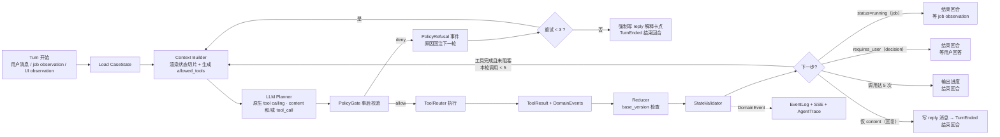

planner 单步语义（返回 `content: str | None` + `tool_call: ToolCall | None`）：**content + tool_call** → content 是过程叙述，流式推送并落 messages 表（`kind=narration`，参与后续上下文回灌），随后照常执行工具；**仅 tool_call** → 照常执行；**仅 content（非空）** → 作为最终回复，流式推送并落 messages 表（`kind=reply`），发 `TurnEnded(reason="reply")` 结束回合；**双空**（既无 content 也无 tool_call）→ 非法输出，计入 `max_illegal_outputs` 重试，超限强制写 reply 解释卡点 + `TurnEnded(reason=<forced_reason>)`。单步只取第一个 tool_call（保持单工具约束），多余的丢弃并记 trace。拒绝越界 = 直接用散文说明；"无话可说地结束" = 输出一句简短 content 不带工具调用。

预算与保险丝：单条用户消息内最多连续 5 个非阻塞工具调用；单回合含重试的工具调用硬上限 12 次，触发即强制结束并输出诊断。长任务必须 job 化，绝不在 turn 内同步等待。

### 4.2 单轮时序图（happy path + decision 分支）

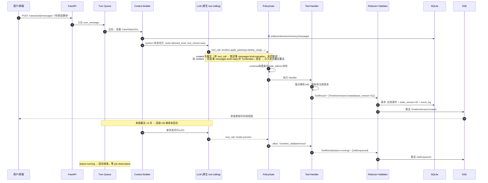

### 4.3 Context Builder 契约

每轮从 CaseState **重建**上下文，不依赖对话历史累积。原则：**结构化状态永远从 CaseState 渲染、绝不进有损压缩；只压自由对话片段。**

**注入区块与 token 预算（总预算默认 24k，可配置）：**

| 区块 | 内容 | 预算 | 截断策略 |
|---|---|---|---|
| system | 角色、边界、PolicyGate 摘要规则 | 1.5k | 固定不截断 |
| workspace | active project 名称、defaults（比例/fps） | 0.3k | 固定 |
| case_header | Case 名、宏观阶段(§5.3)、last_error、running_jobs 摘要 | 0.5k | 固定 |
| artifacts | brief、content_plan 摘要、audio_plan、cut_plan 摘要、timeline 摘要 | 6k | 离当前动作近者优先 |
| pending_decision | 当前 Decision 全文 + 选项 | 1k | 固定 |
| memory | memory.search_relevant top-k（k ≤ 5）摘要 | 1.5k | 按相关性截断 |
| assets | 素材摘要索引：每个已 link 素材一行（文件名、kind、时长、understanding_status、semantic_role、overall 截断）+ 本 Case selected/disabled ID | 1k | 完整 segments 不常驻，主代理需要时调 `understand.materials`（命中缓存取全文）或 `asset.read_summary` |
| messages | 最近消息窗口 + 更早对话的滚动摘要 | 8k | 滚动摘要 |
| allowed_tools | 本轮合法工具 schema | 4k | 由前置条件表决定，不截断 |

**timeline 摘要格式**（全量 TimelineState 永不进 prompt）：

```text
Timeline v8 · 45.0s @30fps · 9:16
[00.0-03.2] slot_hook  A-roll asset_007/clip_002 「开箱特写」 字幕:"这瓶精华我回购三次了"
[03.2-08.4] slot_pain  B-roll asset_012/clip_005 「揉太阳穴」 字幕:"熬夜脸真的暗沉"
...
audio: voiceover(TTS volcano) 0-45s · bgm: 无 · 原声: 关
```

**滚动摘要与 write-before-compaction**：消息区超预算时，把最老一段对话压成要点；压缩前先把其中的**事实性结论**（用户偏好、已做决定）写入 CaseState.brief 或 scratch_memory，再压。决策一律以 Decision 记录为准，不赌摘要保真。

**allowed_tools 生成流程：**

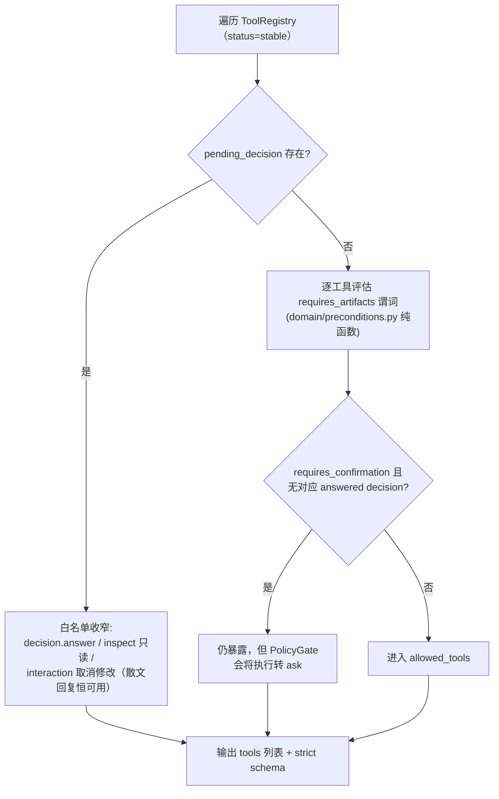

### 4.4 PolicyGate：事前裁剪 + 事后校验

PolicyGate 是代码硬规则。双向：

1. **事前**（经 Context Builder）：不合法工具**连 schema 都不暴露**，从源头减少无效轮次。
2. **事后**（LLM 输出后）：即使在 allowed_tools 内仍硬校验。裁决四值（参照 Claude Agent SDK PreToolUse 语义）：

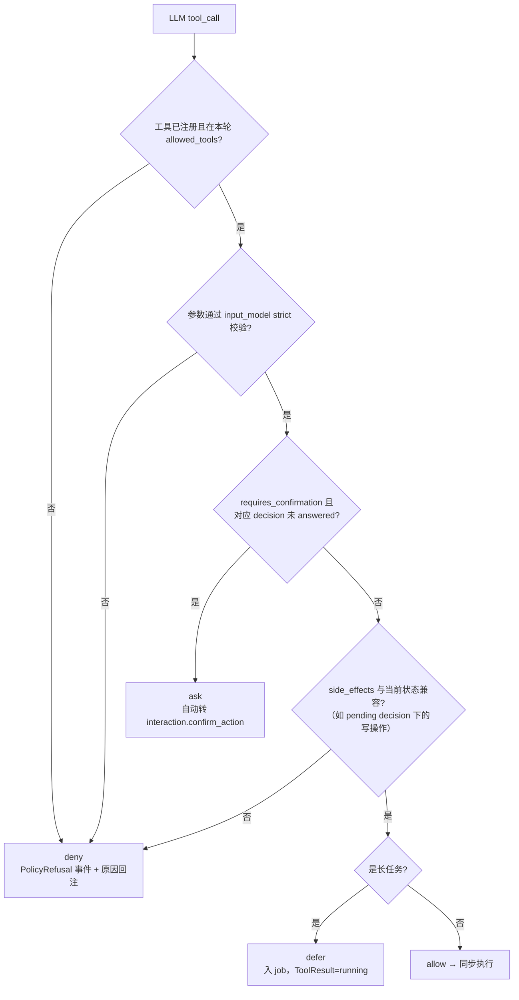

**ask 裁决的统一确认机制（PendingToolCall）**

需要人工确认的工具（`requires_confirmation=true`：project.delete、project.move_case、asset.import_url、render.final_mp4、`generate_subtitles`/`add_bgm` 新增类 patch op——免 gate 的样式/文本/删除/音量类 op 见 §5.2）采用**单阶段"暴露 + 拦截 + 续执行"**，不拆 request_*/execute_* 两套工具（避免工具数翻倍、LLM 心智负担和两阶段间的状态漂移）。**例外：`memory.save` 不走本机制**——它的唯一 human gate 是 memory_scope decision，answered 后由 harness 按 §7.6.1 直接入队执行（scope/candidate_id 来自 answer），不设 requires_confirmation：

1. 这些工具**恒可按 §5.2 的 artifact 前置条件暴露**给 LLM；"是否已确认"不作为暴露条件。
2. LLM 调用时，PolicyGate 检查是否存在对应的 answered confirm decision（由 `confirmation_decision_type` + 参数指纹匹配）。没有 → 裁决 `ask`：**工具不执行**，自动创建 confirm Decision，并把本次调用（tool_name + arguments + idempotency key + 参数指纹）存入 `decision.pending_tool_call`。
3. **重放 = outbox 模式（两段事务）**。状态机：`pending_tool_call_status: pending → approved → replayed / discarded`。
   - 归约事务（Reducer）：用户确认 → 记 `DecisionAnswered` + status 置 `approved`；用户拒绝 → status 置 `discarded`。**Reducer 永不执行工具**。
   - 重放事务（harness，归约事务提交后）：先以独立事务 CAS `approved → replayed`（同事务写 `consumed_at`、`replayed_tool_call_id`），CAS 成功才执行工具（case 级入 Turn Queue，project 级直接执行）；CAS 失败说明已被消费，跳过。
   - 崩溃恢复：启动时扫描 `pending_tool_call_status=approved` 的 decision 重新入队重放——CAS 保证恰好一次；若 CAS 成功后执行前崩溃，靠工具幂等键兜底（见 4）。注意 `pending_tool_call_status` 与 `Decision.status`（pending/answered/cancelled，只表示问题本身的状态）是两个独立字段，不得混用。
4. **幂等兜底**：pending_tool_call 的重放以 `decision_id` 纳入工具 idempotency key（jobs 表 `(kind, idempotency_key)` 唯一索引，同步工具在 handler 层查重）——崩溃恢复、重复 observation、同参数重发都不会双执行。参数指纹不匹配（确认后改参数重发）→ 视为新调用重新走 ask；answered confirm decision 不跨调用复用。

**Decision 作用域**：Decision 带 `scope_type: workspace | project | case`。case 级 blocking decision 写入 `CaseState.pending_decision_id` 并触发 §4.4 事前收窄；**project/workspace 级 decision 不进任何 CaseState**（如素材页发起的 URL 导入确认、Project 删除确认），由对应页面 UI 呈现、经 workspace 级 SSE 推送，其 pending 状态只阻塞自身 pending_tool_call，不阻塞任何 Case 的 Agent loop。

### 4.5 DomainEvent 与 Reducer（唯一写路径）

工具不直接改状态，返回 `ToolResult`，携带**类型化 DomainEvent 列表**；Reducer 集中翻译为状态变更。**事件即 EventLog 条目、即 SSE 推送体、即 AgentTrace 状态记录——三者同源。**

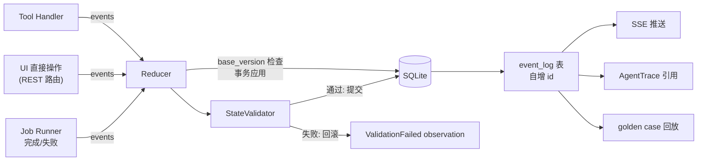

```json
{
  "tool_call_id": "tc_001",
  "tool_name": "timeline.apply_patch",
  "status": "succeeded | failed | running | requires_user",
  "observation": "已删除 7.0s-8.4s 的停顿，并同步字幕。",
  "artifacts": [{"artifact_id": "tl_v9", "kind": "timeline_version"}],
  "events": [
    {"event": "TimelineVersionCreated", "case_id": "case_007", "base_version": 31,
     "payload": {"timeline_version": 9, "patch_id": "patch_012", "parent_version": 8}}
  ],
  "error": null
}
```

**事件全集（contracts/events.py 判别联合）：**

| 事件族 | 事件 |
|---|---|
| Project | ProjectCreated / ProjectRenamed / ProjectTrashed / ProjectCopied |
| Case | CaseCreated / CaseRenamed / CaseCopied / CaseMoved / CaseClosed / CaseTrashed |
| Asset | AssetImported / AssetProbed / ProxyGenerated / AssetIndexReady / AssetIndexFailed / AssetInvalidated / AssetLinked / AssetUnlinked / CaseAssetScopeChanged |
| Understanding | MaterialUnderstandingStarted / MaterialUnderstandingCompleted / MaterialUnderstandingFailed |
| Decision | DecisionCreated / DecisionAnswered / DecisionCancelled |
| Plan | BriefUpdated / ContentPlanUpdated / AudioPlanUpdated / CutPlanUpdated / PostprocessPlanUpdated |
| Timeline | TimelineVersionCreated / TimelineVersionRestored / TimelineValidated / TimelineValidationFailed |
| Render | PreviewRendered / PreviewViewed / ExportCompleted |
| Memory | MemoryCandidateExtracted / MemoryCandidateDiscarded / MemorySaved |
| Job | JobEnqueued / JobProgress / JobSucceeded / JobFailed / JobCancelled |
| Harness | PolicyRefusal / ProviderCallRecorded / ContextCompacted / TurnEnded / CapabilityDegraded / SecurityRefusal |

**Reducer 版本规则：权威事件表（每个 DomainEvent 一一归类）**

所有事件经单 Reducer 串行应用；`strict` 表示必须携带发起时的 Case `state_version`，不匹配即拒绝；`merge` 表示 `base_version=null`，按幂等键合并，不做版本校验（**job 运行期间用户消息推进了 state_version 不影响其结果落库**）。

| 事件 | 版本 | 幂等/合并键 | 状态影响 |
|---|---|---|---|
| ProjectCreated/Renamed/Trashed/Copied | merge | project_id | ProjectState |
| CaseCreated/CaseMoved/CaseClosed | merge | case_id | Case 结构；**Agent 与 UI 皆可发起**（project.create_case / move_case / close_case） |
| CaseRenamed/CaseCopied/CaseTrashed | merge | case_id | Case 结构；**仅 UI/REST 发起**（§6，Agent 无对应工具）；引用一致性由 Validator 保证 |
| AssetImported/AssetProbed/ProxyGenerated/AssetIndexReady/AssetIndexFailed/AssetInvalidated | merge | asset_id (+job_id) | AssetRecord |
| AssetLinked/AssetUnlinked | merge | (project_id, asset_id) | ProjectAssetLink |
| CaseAssetScopeChanged | strict | — | CaseState.selected/disabled |
| DecisionCreated/Answered/Cancelled（scope=case） | strict | decision_id | pending_decision_id + Decision 行；**DecisionAnswered 同时拥有 §7.6.1 归约触及的全部 CaseState 字段**（含 approve_rough_cut 的 rough_cut_approved / rough_cut_approved_version——不借道 CutPlanUpdated 暗改） |
| DecisionCreated/Answered/Cancelled（scope=project/workspace） | merge | decision_id（status 字段 CAS） | 仅 Decision 行，不触碰任何 CaseState |
| BriefUpdated/ContentPlanUpdated/AudioPlanUpdated/CutPlanUpdated/PostprocessPlanUpdated | strict | — | 对应 artifact 字段 |
| MaterialUnderstandingStarted/Completed/Failed | merge | asset_id | material_summaries 行 + ASSETS.understanding_status（none/running/ready/failed），不改 CaseState |
| TimelineVersionCreated/Restored | strict | — | timeline_current_version、timeline_validated=false、按 §7.6.1 规则可能重置 rough_cut_approved |
| TimelineValidated/TimelineValidationFailed | strict | — | timeline_validated + validation_report |
| PreviewRendered/ExportCompleted | merge | (timeline_version, artifact_id) | 永远记录产物行；仅当 timeline_current_version 仍等于其 timeline_version 时更新 current 指针，否则作为历史产物保留并在 observation 注明 |
| PreviewViewed | merge | preview_id | last_viewed_preview_id（仅当 preview 属于本 Case） |
| MemoryCandidateExtracted/MemoryCandidateDiscarded/MemorySaved | merge | candidate_id / memory_id | MEMORY_CANDIDATES / MEMORIES 行，不改 CaseState |
| JobEnqueued/Progress/Succeeded/Failed/Cancelled | merge | job_id | jobs 行 + CaseState.running_jobs（Cancelled 同样清理 running_jobs 并按 §4.10 路由 observation） |
| PolicyRefusal/ProviderCallRecorded/ContextCompacted/TurnEnded | merge | 各自 id | 纯记录，不改 CaseState |
| CapabilityDegraded（payload: capability, provider_id, reason, fallback） | merge | 各自 id | 纯记录；**用户可见**——带 case_id 推 Case+Workspace SSE（§4.8 降级硬规则的事件载体） |
| SecurityRefusal（payload: route, path/origin, reason；actor=system） | merge | 各自 id | 纯记录；推 Workspace SSE（§13.0 安全拒绝的事件载体） |

**SSE 路由规则（逐事件推导）**：事件按其携带的归属键路由，无需逐事件手工登记——①带 `case_id`（或 job 事件的 `requested_by_case_id`）→ 推 Case 级端点 + Workspace 级端点；②只带 `project_id` / `asset_id`（Project/Asset/AssetLink、project 级 Decision、project 级 job）→ 只推 Workspace 级端点；③Memory 事件 → Workspace 级（MemoryCandidate* 另因带 case_id 同时推 Case 级）；④记录型 `PolicyRefusal / ProviderCallRecorded / ContextCompacted` → **不推 SSE**（进 EventLog 与 AgentTrace，前端不需要实时感知）；⑤`TurnEnded` → 只推 Case 级（驱动 UI 输入框/加载态）；⑥`CapabilityDegraded` → 用户必须可见：带 case_id 推 Case+Workspace，否则推 Workspace；`SecurityRefusal` → 推 Workspace。SSE 端点做的就是按此规则过滤 event_log。

**不是 DomainEvent 的两样东西**：`version_conflict` 与 `ValidationFailed` 是 **Reducer 拒绝的结果**——状态未发生变化，因此不进 EventLog；它们记入 AgentTrace 并以 ToolResult error / observation 形式回到发起方。新增事件类型时必须同步在本表登记归类，CI（check_contracts.py）断言事件联合与本表一一对应。UI 直接操作与 Agent 工具走同一 Reducer。

### 4.6 StateValidator 全局不变量

事件应用后校验，失败整个事务回滚并产生 ValidationFailed observation：

1. Case 引用的 timeline_current_version / preview_current_id / pending_decision_id 必须存在且归属本 Case。
2. pending_decision_id 指向的 Decision 状态必须是 pending。
3. timeline 不变量（§10.2）：primary visual track 无漏帧无重叠等。
4. selected/disabled_asset_ids ⊆ Project 已链接素材。
5. 事件作用域一致：Case 工具产生的事件不得修改 Project 素材池；Project 素材事件不得修改 CaseState。

### 4.7 AgentTrace 与 Golden Case 回放（M0 交付）

- **AgentTrace**：每轮落库——context 注入摘要（各区块 token 计数）、allowed_tools 列表、LLM 原始 tool_call、PolicyGate 裁决、ToolResult、DomainEvents、耗时与 token 用量。
- **Golden case**：`tests/golden/` 存 `{workspace fixture, 用户消息序列, mock provider 响应脚本, 期望工具轨迹（可通配）, 最终状态断言}`；CI 用 mock ProviderGateway 回放。
- 最小集：原声粗剪主路径、TTS 种草主路径、pending decision 阻塞、非法工具拒绝、version conflict、job 失败恢复、patch 锚点冲突转询问。

### 4.8 错误升级策略

| 场景 | 规则 |
|---|---|
| LLM 输出非法（deny / schema 失败） | 原因回注重试，同回合 ≤ 3 次；超限强制写 reply 解释卡点 + TurnEnded 结束回合 |
| Provider 调用失败 | adapter 内指数退避重试（默认 2 次）；仍失败 → ToolResult=failed，Agent 必须解释并给可执行下一步 |
| Job 失败 | JobFailed 事件带结构化错误（error_code、stderr 摘要、可重试标记）；Agent 不得静默重试 > 1 次 |
| 循环保险丝 | 单回合工具调用（含重试）≤ 12 次，触发强制结束 + 诊断 |
| 一切降级 | 必须产生 `CapabilityDegraded` 事件（用户可见，SSE 推送），不允许静默吞掉（CutFlow 证据链原则） |

### 4.9 Case Turn Queue（排队语义）

每个 Case 一条严格串行队列；跨 Case 可并行；同 Case 永不并发两轮。

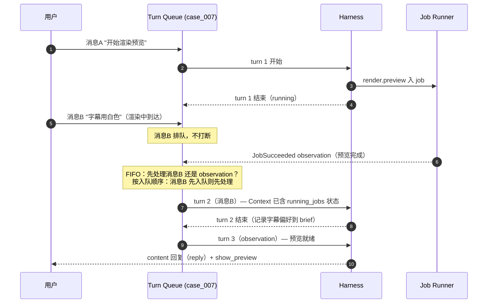

- 入队项：用户消息、job observation、UI 操作 observation，先入先出。
- 用户显式"停止"是唯一抢占：置 cancel 标记，当前工具执行完后终止回合；运行中 job 不强杀（用户在 UI 决定是否取消 job）。

### 4.10 Job 生命周期

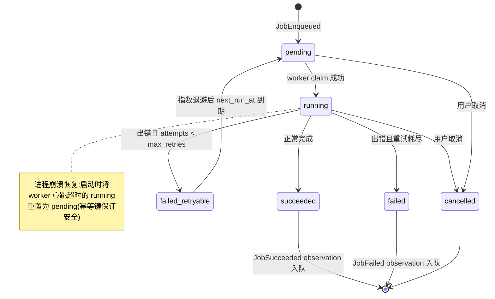

**Job scope 与 observation 路由**：每个 job 必有 `project_id`，`case_id` 可空。

| job 类型 | 触发方 | 完成后去向 |
|---|---|---|
| case 级（asr / tts / render_preview / render_final / align） | Case 内 Agent | observation 入该 Case Turn Queue；进 CaseState.running_jobs |
| project 级（proxy / index / import 下载） | 素材页 UI / proxy 完成自动链入 index | **不进任何 Turn Queue**：落 EventLog + workspace 级 SSE 更新素材页；Agent 下轮从素材统计自然看到 |
| project 级但由 Case 内 Agent 触发 | Case 内 Agent | 记 `requested_by_case_id`，完成后 observation 入该 Case Turn Queue（Agent 在等这个结果）；同时照常发 workspace SSE |

注：**素材理解不是 job**——`understand.materials` 在 turn 内同步派子代理并 `asyncio.gather` 并发（§4 子代理机制），不入 job 队列；上传只自动跑便宜 index job（本地无网络）。

CaseState.running_jobs 只收 case_id 或 requested_by_case_id 指向本 Case 的 job。素材页的 job 进度查询走 `GET /api/projects/{pid}/materials`（含各 asset 的 job 状态）与 workspace SSE。

**Worker 并发**：job runner 从单并发串行升为小并发池（默认 2–3，配置项），让 index/proxy 这类短活不被长活（render/asr/tts）饿死；claim 幂等键保证同一 job 不被重复领取。

### 4.11 素材理解子代理（agentic 按需理解）

主代理需要素材信息时调 `understand.materials(asset_ids, focus?)`（§6.x）。它不是 job、不入队，而是在 **turn 内同步**派出「素材理解子代理」，复用 harness 的小循环设施：

- **执行模型**：每个 asset 一个理解子代理，独立 system prompt（素材理解员：产出忠实、带时间戳、可直接用于剪辑决策的摘要）、独立步数预算（默认 12）、多模态模型 profile（qwen-vl 系，配置项）。子代理工具白名单：`read_index`（读便宜索引：元数据/分镜/VAD/波形）、`view_frames`（指定秒抽帧进多模态上下文，复用现有 ffmpeg 抽帧）、`transcribe`（触发/复用 ASR 写 transcripts，VAD 无语音直接报告）、`emit_summary`（终结动作：提交 MaterialSummary，schema 校验不合格重试）。
- **并发**：主代理侧 `asyncio.gather` 并发跑各 asset 子代理，上限配置（`RUSHES_UNDERSTAND_CONCURRENCY`，默认 3）。
- **超时**：单素材超时（`RUSHES_UNDERSTAND_TIMEOUT_S`，默认 300s）；超时标记该 asset failed，不拖累其它。
- **缓存语义**：asset 已有 `ready` 摘要且 `focus` 为空 → 直接返回缓存不起子代理；带新 `focus` → 子代理带着旧摘要增量深挖，产出合并后的新版本（version+1）。
- **trace 归属**：子代理每步照记 TraceRecorder，标记 subagent 归属；进度经 Spec B 的 turn-stream 推送 `subagent_progress`（"正在查看 xxx.mp4 02:10 画面"），用户全程可见。
- **失败语义**：子代理超时/报错 → 主代理拿到失败 observation，可重试（再调 `understand.materials`）或跳过并在回复中告知用户，**不再有「理解失败不能参与剪辑」硬门**。

产物落 `material_summaries` 表（asset_id, version, status, summary_json, focus），`ASSETS.understanding_status` 冗余列供列表页；领域事件 `MaterialUnderstandingStarted/Completed/Failed` 由 reducer 更新状态列并经 SSE 驱动 UI。

## 5. Case 进度模型（artifact 驱动，无线性状态机）

### 5.1 CaseState schema

```json
{
  "case_id": "case_007",
  "project_id": "project_001",
  "name": "产品种草第一版",
  "state_version": 31,
  "status": "active | closed | trashed",

  "pending_decision_id": null,
  "running_jobs": [],
  "last_error": null,

  "brief": {
    "goal": "30 秒小红书种草",
    "platform": "xiaohongshu",
    "target_duration_sec": 30,
    "style_notes": ["快节奏", "字幕要白色"],
    "confirmed_facts": []
  },
  "content_plan": null,
  "audio_plan": null,
  "cut_plan": null,
  "timeline_current_version": null,
  "timeline_validated": false,
  "preview_current_id": null,
  "last_viewed_preview_id": null,
  "rough_cut_approved": false,
  "rough_cut_approved_version": null,
  "postprocess_plan": null,
  "export_current_id": null,

  "selected_asset_ids": [],
  "disabled_asset_ids": [],
  "scratch_memory": {},
  "messages_tail_ref": "msg_tail_007"
}
```

设计要点：没有 `phase` 字段。进度由 artifact 字段的存在性表达；三个 overlay（pending_decision / running_jobs / last_error）与进度正交；`last_viewed_preview_id` 是 patch 时间引用锚点（§7.8）；`brief.confirmed_facts` 是 write-before-compaction 的落点（§4.3）。

### 5.2 工具前置条件表（PolicyGate 与 Context Builder 共用，谓词注册在 domain/preconditions.py）

**本表是"非平凡前置条件"的摘录，不是全量清单**：未列出的工具（project.create/copy、asset.import_local_file 等）前置条件仅为 `allowed_scopes` + `requires_active_project/case`，权威定义在各自 ToolSpec.requires_artifacts。`scripts/check_contracts.py` 从 ToolRegistry 生成机器可校验的全量 registry 表（工具 × 前置谓词 × 事件，见 §6），CI 断言文档摘录与 registry 无冲突。

| 工具 | 前置条件（全部满足才暴露给 LLM） |
|---|---|
| `content.create_plan` / `content.revise_plan` | active case |
| `audio.inspect_sources` | ≥ 1 usable asset |
| `audio.asr_original` | audio_plan.mode ∈ {keep_original, rough_cut} 且对应素材有音轨 |
| `audio.rough_cut_speech` | audio_plan.mode = rough_cut 且对应素材的 **TranscriptDocument 已存在**（含 vad_segments）——ASR 未完成前不暴露 |
| `audio.generate_tts` | audio_plan.mode = tts 且 content_plan 存在 |
| `audio.align_uploaded_voiceover` | audio_plan.mode = uploaded_voiceover 且配音 asset 存在 |
| `understand.materials` | active project 且 ≥ 1 目标 asset 存在（非破坏、成本有界，PolicyGate 无需人工确认；缺 focus 命中缓存直接返回，不起子代理） |
| `asset.read_summary` | active project（只读最新 ready 摘要，无副作用；allowed_scopes 含素材页与 Case Console） |
| `timeline.compose_initial` | active_case 且 **audio_plan 已确认** 且 ≥ 1 usable 未禁用 asset（基于摘要时间戳直接组装 v1） |
| `timeline.apply_patch` / `validate` / `inspect` / `restore_version` | timeline_current_version != null |
| `render.preview` | timeline_current_version != null 且 timeline_validated |
| `timeline.apply_patch` 之 **gated op 白名单 = {`generate_subtitles`, `add_bgm`}**（新增后处理内容） | rough_cut_approved = true。postprocess_plan 对应项已存在 → 直接执行；不存在 → **不是拒绝，而是 §4.4 ask**：自动创建 subtitle/bgm Decision 并暂存该 patch，answered 归约进 postprocess_plan 后重放（选跳过则 discard）。**免 gate**：`set_subtitle_style` / `edit_subtitle_text` / `remove_track_clips` / `adjust_gain`——它们是对已存在轨道内容的用户直接指令（新增 gate 已过，减法/微调即指令即确认），仅需 timeline 存在 |
| `render.final_mp4` | timeline_validated = true **且当前 timeline 版本已有 preview**（所见即所得硬门）；导出确认经 §4.4 ask 机制，若该 preview 未被观看（无 PreviewViewed），确认问句必须注明"你还没看最新预览" |
| `memory.save` | **harness-internal，不暴露给 LLM**（ToolSpec.exposure=harness_only）：memory_scope answered 后由 harness 按 §7.6.1 自动入队执行；handler 按 candidate status 幂等（非 pending 即拒绝，防重复保存） |
| `project.delete` / `project.move_case` / `asset.import_url` | 恒可暴露（scope 满足即可）；执行时经 §4.4 ask 机制确认 |
| inspect/list 只读类、`interaction.*`、`decision.answer` | 恒可用（pending decision 时按 §4.4 收窄；散文回复不占工具、恒可用） |

新增工具 = 声明所需谓词，不改任何状态机。**代码中任何地方不得以宏观阶段做工具门控。**

### 5.3 宏观阶段（推导值，仅 UI 与上下文压缩用）

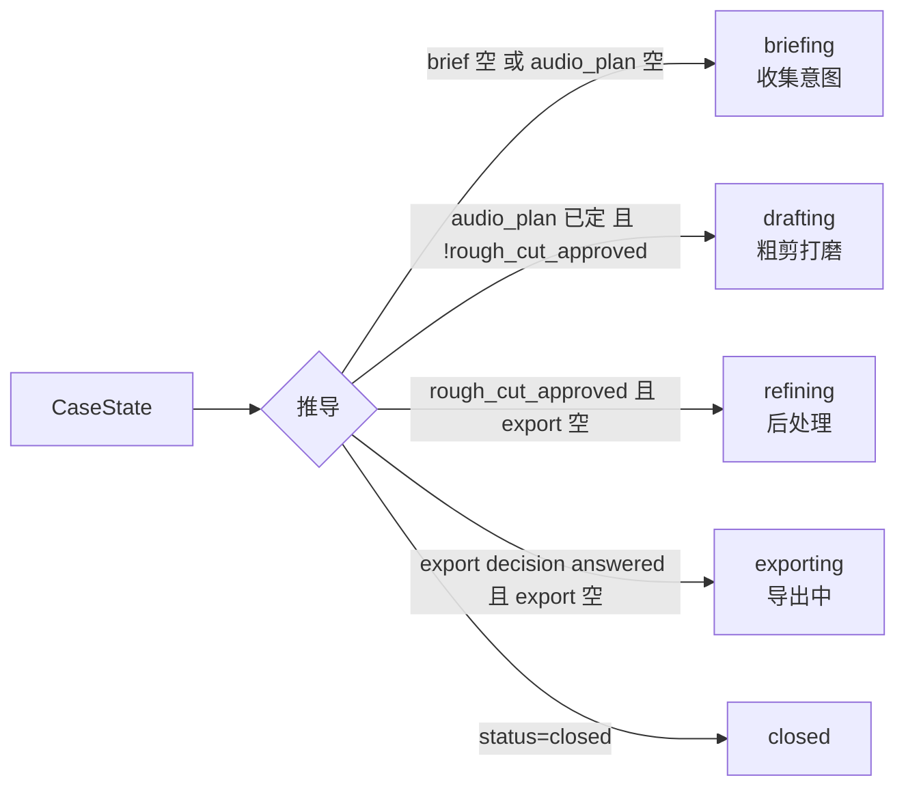

推导函数在 `domain/case_stage.py`，供 UI 进度指示与 Context Builder 的 case_header 使用。**条件按固定顺序求值，首个匹配生效**：`closed → exporting → refining → drafting → briefing`（消除 refining/exporting 等条件重叠的歧义）。

### 5.4 Decision overlay

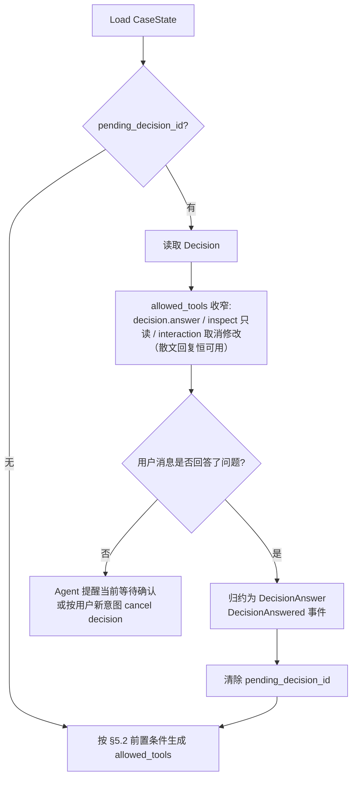

任何宏观阶段都可能被 decision 阻塞。除非用户明确改变目标（此时 Agent 可 cancel 当前 decision 并另立），Agent 不得绕过 pending decision 执行后续剪辑工具。

### 5.5 running_jobs 与 last_error overlay

- `running_jobs`：`[{job_id, kind, progress}]`。job 与 turn 解耦；完成后 observation 入 Turn Queue。Case 可以同时"正在渲染预览"且用户在聊字幕偏好。
- `last_error`：最近未解决错误（结构化：error_code、message、来源 tool/job、可重试标记）。被下一次成功操作或用户显式忽略清除。**failed 不是阶段**——所有 artifact 保持原样，修复后原地继续。

### 5.6 典型推进路径（示意，非固定流程）

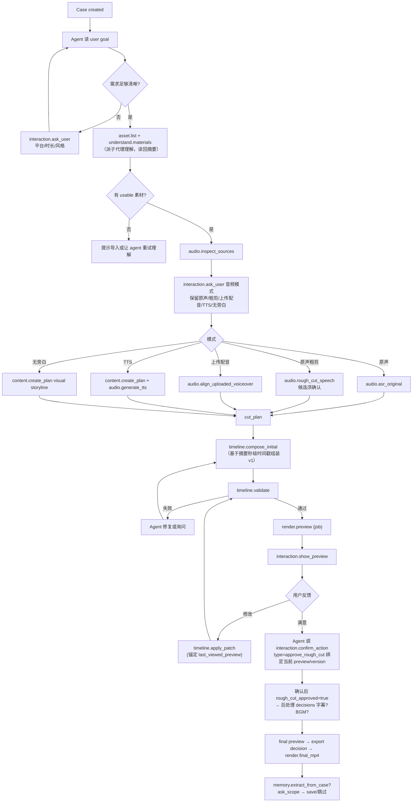

Agent 可跳过任何非必需节点（如无旁白场景直接 visual storyline），前提是 §5.2 的谓词满足——这就是"自由路径 + 硬门控"的含义。

## 6. 工具契约

粒度原则：一个工具代表 Agent 能清楚决策的一步；不细到内部函数，不粗到"剪完整条视频"。每个工具必须定义：输入 schema、输出 schema、前置谓词、产生的 DomainEvent、验收测试。全清单（**MVP 共 47 个**：project 8 + asset 10（含 read_summary）+ understand 1 + interaction 6 + content 3 + audio 5 + timeline 6 + render 3 + memory 4 + 内建 1）：

**Case 的 rename / delete / copy 不是 Agent 工具**（避免 Agent 误删对话工作区），仅由 UI/REST 触发，走同一 Reducer 产生 CaseRenamed / CaseTrashed / CaseCopied 事件；Agent 可见这些变化但不能发起。

### 6.1 project.*（8）

| 工具 | 说明 | 确认 | 主要事件 |
|---|---|---|---|
| `project.create` | 创建 Project | - | ProjectCreated |
| `project.rename` | 重命名 | - | ProjectRenamed |
| `project.delete` | 软删除 | ✓ destructive | ProjectTrashed |
| `project.copy` | 复制（含素材链接，不含 Case） | - | ProjectCopied |
| `project.create_case` | 创建 Case | - | CaseCreated |
| `project.move_case` | Case 移动到另一 Project | ✓ + 素材链接处理 | CaseMoved, AssetLinked* |
| `project.close_case` | 关闭 Case（可逆，重新打开即恢复，不需确认） | - | CaseClosed |
| `project.list_tree` | 返回文件树 | - | -（只读） |

### 6.2 asset.*（10）

| 工具 | 说明 | 确认 | 主要事件 |
|---|---|---|---|
| `asset.upload_complete` | 分片上传完成建档（copy） | - | AssetImported |
| `asset.import_local_file` | 本地路径导入（默认 reference） | - | AssetImported |
| `asset.import_url` | 导入用户显式 URL；确认后入 `import_url` job 下载（只下载该文件，不抓页面），完成后建档进 ingest | ✓ url_import | JobEnqueued → AssetImported |
| `asset.link_to_project` / `unlink_from_project` | 链接/断链 | - | AssetLinked/Unlinked |
| `asset.select_for_case` / `disable_for_case` | 只改 CaseState 作用域 | - | CaseAssetScopeChanged |
| `asset.list_project_assets` / `list_case_scope` | 查询 | - | -（只读） |
| `asset.read_summary(asset_ids)` | 读各 asset 最新 ready MaterialSummary 全文（含 segments 时间戳表）；无摘要则列入 missing | - | -（只读） |

### 6.3 understand.*（1）

`understand.materials(asset_ids, focus?)`：主代理按需理解素材。turn 内同步派「素材理解子代理」并 `asyncio.gather` 并发（§4.11），子代理看帧/听音频/读索引产出带秒级时间戳的 MaterialSummary 落库并回灌主代理。命中缓存（已有 ready 摘要且无新 focus）直接返回不起子代理；带 focus 增量深挖 version+1。非破坏、成本有界，PolicyGate 无需人工确认。→ MaterialUnderstandingStarted/Completed/Failed。

### 6.4 interaction.*（6）

`ask_user`（开放/选择题 → DecisionCreated）、`confirm_action`（确认题 → DecisionCreated）、`show_progress`、`show_preview`、`show_timeline`、`show_error`。**前端结构化渲染的唯一入口**；业务工具不直接操作 UI。

### 6.5 content.*（3）

`create_plan`（脚本 / transcript plan / visual storyline，不强制 TTS 脚本）、`revise_plan`、`extract_transcript_plan`（从原声 ASR 生成结构化口播计划）。

**cut_plan 生产者硬契约**：cut_plan（timeline 组装的前置事实）必须由以下工具显式产出并发 `CutPlanUpdated`，不存在隐式来源：

| audio_plan.mode | cut_plan 生产者 |
|---|---|
| `silent` | `content.create_plan`（visual storyline 模式**同时产出** content_plan 与 cut_plan） |
| `tts` | `audio.generate_tts`（TTS 时间戳到位后，按 content_plan 的 slot 结构物化 cut_plan） |
| `keep_original` | `audio.asr_original`（转写完成后按语音节拍物化 cut_plan） |
| `rough_cut` | `approve_speech_cut` decision 归约（§7.6.1，确认的删除区间写入 removed_ranges 即完成 cut_plan） |
| `uploaded_voiceover` | `audio.align_uploaded_voiceover`（对齐完成后物化 cut_plan） |
| `mixed` | 派生模式，由 Agent 在既有 cut_plan 上经 AudioPlanUpdated 调整 |

CutPlan 最小 schema：

```json
{
  "schema": "CutPlan.v1",
  "slots": [{"slot_id": "slot_hook", "brief": "开头钩子", "target_duration_sec": [2.0, 4.0],
             "narration_ref": {"utterance_ids": ["u_001"]}}],
  "removed_ranges": [{"start_ms": 7000, "end_ms": 8400, "kind": "filler", "source": "approve_speech_cut"}],
  "total_target_duration_sec": 30
}
```

### 6.6 audio.*（5）

`inspect_sources`（本地 ffprobe + Silero VAD，不调云端）、`asr_original`（job：抽轨→云端 ASR）、`rough_cut_speech`（TranscriptDocument+VAD → 删除候选，须确认）、`generate_tts`（job：火山 TTS 时间戳链路）、`align_uploaded_voiceover`（云端 ASR + 本地 DP 对齐）。原素材有声音时不得默认 TTS，必须给五路径选项。

### 6.7 timeline.*（6）

`compose_initial`（LLM 基于摘要给**秒级** source 段落 + role 直接组装 v1 初剪，materializer 换算成帧级 TimelineState）、`insert_clip`（在既有时间线按摘要时间戳补插一段 clip）、`apply_patch`（输入 TimelinePatchRequest，§7.8）、`validate`、`inspect`、`restore_version`。**LLM 不允许输出帧值、素材内部帧/时间码定位、文件路径、ffmpeg 参数**——这些字段在 LLM 可见的工具 schema 中不存在；compose_initial/insert_clip 的 source 范围以**秒（float）**表达，渲染层负责换算。用户口中的时间（秒）作为 compose_initial 的 source 段落、或 TimelinePatchRequest 中锚定 `reference` 的时间引用出现，由 Timeline Engine 解析为帧（§7.8 两阶段结构）。

**关于"后处理"**：不存在独立的 postprocess namespace。字幕/BGM 统一走 `timeline.apply_patch`：**新增类 op（generate_subtitles / add_bgm）受 postprocess_plan gate**（§5.2 白名单，缺失时 ask+暂存）；样式/文本/删除/音量类 op（set_subtitle_style / edit_subtitle_text / remove_track_clips / adjust_gain）是用户直接指令，免 gate。

### 6.8 render.*（3）

`preview`（低画质 proxy 参数，job）、`final_mp4`（高画质，job；导出确认经 §4.4 ask 机制）、`status`。

### 6.9 memory.*（4）

`extract_from_case`（从最终结果与修改轨迹提取候选经验，**持久化写入 MEMORY_CANDIDATES 表**，status=pending → MemoryCandidateExtracted）、`ask_scope`（对指定 candidate_id 创建 memory_scope decision）、`save(candidate_id, scope)`（**exposure=harness_only，不暴露给 LLM**：memory_scope answered 后由 harness 自动入队执行；读 MEMORY_CANDIDATES.content 落 MEMORIES，候选置 saved 并回填 saved_memory_id；handler 按候选 status 幂等，非 pending 即拒绝）、`search_relevant`（供 Context Builder）。用户跳过时候选置 discarded——保存哪段内容由 candidate_id 唯一确定，不依赖对话上下文。

### 6.10 内建动作（1，harness 层注册为工具）

`decision.answer`（把用户自然语言归约为 DecisionAnswer——通常由 harness 在检测到 pending decision 被回答时代为调用）。

`respond` / `refuse` / `finish_turn` 已退役（Spec B，`content` 即散文）：向用户说话 = planner 直接输出 `content`；越界拒绝 = 用散文说明；结束回合 = 仅输出 content 不带工具调用（harness 落 `reply` 并发 `TurnEnded`）。三者已从 registry、ToolSpec、PolicyGate 特判中移除。

## 7. 统一数据契约

所有 schema 用 Pydantic v2 定义在 `packages/contracts/`（零业务依赖）。**FastAPI OpenAPI 是前后端契约事实源**，前端类型用 openapi-typescript 生成。内部权威时间单位是 frame（整数，工程 fps 锁定默认 30），所有区间半开 `[start, end)`；对用户展示才换算为秒；源素材原生帧率与工程帧率的换算只发生在 materializer 边界一次。

### 7.1 ProjectState

```json
{
  "project_id": "project_001",
  "name": "七月产品内容",
  "status": "active | archived | trashed",
  "asset_links": [{"asset_id": "asset_001", "enabled": true, "linked_at": "...", "note": ""}],
  "case_ids": ["case_001", "case_002"],
  "memory_ids": ["mem_project_001"],
  "defaults": {"aspect_ratio": "9:16", "fps": 30, "preview_quality": "low", "export_quality": "high"},
  "created_at": "...", "updated_at": "..."
}
```

### 7.2 CaseState

见 §5.1。

### 7.3 AssetRecord

```json
{
  "asset_id": "asset_001",
  "storage_mode": "copy | reference",
  "workspace_object_uri": "object://ab/cd/abcd.../source.mp4",
  "reference_path": "/Users/me/Movies/raw/a.mp4",
  "kind": "video | image | audio | font",
  "source": "upload | local_path | url",
  "filename": "source.mp4",
  "hash": "sha256:...", "mtime": 1751600000, "size": 1048576000,
  "probe": {"duration_sec": 48.2, "fps": 29.97, "width": 1080, "height": 1920, "has_audio": true},
  "proxy_object_uri": "object://...",
  "ingest_status": "imported | probing | proxying | indexed | failed",
  "usable": false,
  "failure": null
}
```

`copy` 模式 `reference_path=null`；`reference` 模式 `workspace_object_uri=null`（proxy 仍指向 object store）。便宜索引与理解状态在库里是加法列（`thumbnail_object_hash`、`index_json`、`understanding_status`，见 §3.2 ER 图），非 AssetRecord core 契约字段——它们由 index job 与 understanding 事件写入。

### 7.4 MaterialSummary（理解子代理产出的带时间戳结构化摘要）

理解子代理（§4.11）用 `emit_summary` 终结动作提交，schema 校验不合格重试；落 `material_summaries` 表（`packages/contracts/understanding.py`）。

```json
{
  "asset_id": "asset_001",
  "version": 2,
  "focus": null,
  "semantic_role": "speech_footage | footage | music | voiceover | ambient | photo | font | other",
  "overall": "整体一句话概述",
  "language": "zh",
  "segments": [
    {"start_s": 0.0, "end_s": 12.4, "description": "…", "transcript": "…或省略",
     "tags": ["产品特写"], "quality": "good | usable | avoid", "notes": "手抖/过曝等"}
  ],
  "generated_at": "...", "model": "...",
  "spent": {"frames_viewed": 9, "asr_seconds": 84.0}
}
```

字段要点：

- **时间单位统一秒（float）**，半开区间语义交给消费方；渲染层在 materializer 边界换算成帧（§6.7、§7.8）。
- `segments` 是主代理选材/组装 `timeline.compose_initial` 的直接依据（每段的 `quality` 与 `description` 决定取舍）；图片/字体可为空数组。
- `version`：`focus` 深挖时子代理带旧摘要增量产出新版本（version+1）；主代理与 `asset.read_summary` 都读最新 `ready` 版本。
- `language` 仅在有语音时给出；无语音素材省略或为 null。
- `spent` 记录该次理解花掉的看帧数/转写秒数，供成本审计。

多版本累积于 `material_summaries(asset_id, version, status, summary_json, focus, model, created_at)`；`ASSETS.understanding_status` 冗余展示。领域事件 `MaterialUnderstandingStarted/Completed/Failed` 见 §4.5 归约表。

### 7.5 TranscriptDocument（ASR 归一化输出）

```json
{
  "schema": "TranscriptDocument.v1",
  "transcript_id": "tr_001", "asset_id": "asset_001",
  "language": "zh",
  "provider_id": "aliyun_paraformer_v2",
  "raw_preserved": true,
  "utterances": [{
    "utterance_id": "u_001",
    "text": "呃这个产品我用了三周",
    "start_ms": 1200, "end_ms": 4800,
    "words": [{"w": "呃", "start_ms": 1200, "end_ms": 1450, "type": "filler | word | punct"}]
  }],
  "vad_segments": [{"start_ms": 0, "end_ms": 1200, "kind": "silence | speech"}],
  "warnings": []
}
```

`raw_preserved=true` 表示 provider 确认关闭了顺滑/ITN（口癖保留）；false 时 rough_cut 必须降级（§9.3）。`vad_segments` 由本地 Silero VAD 生成后合并。

### 7.6 Decision 与 DecisionAnswer

```json
{
  "decision_id": "dec_001",
  "scope_type": "workspace | project | case",
  "project_id": "project_001",
  "case_id": "case_007",
  "type": "audio_mode | approve_content_plan | approve_speech_cut | approve_rough_cut | subtitle | bgm | export | memory_scope | destructive_project_action | url_import | generic",
  "question": "原视频里有人声，这次怎么处理声音？",
  "options": [
    {"option_id": "keep_original", "label": "保留原声"},
    {"option_id": "rough_cut", "label": "口播粗剪"},
    {"option_id": "uploaded_voiceover", "label": "使用上传配音"},
    {"option_id": "tts", "label": "使用 TTS"},
    {"option_id": "silent", "label": "无旁白视频"}
  ],
  "allow_free_text": true,
  "status": "pending | answered | cancelled",
  "answer": {"option_id": "rough_cut", "free_text": null, "answered_via": "button | natural_language"},
  "pending_tool_call": null,
  "pending_tool_call_status": null,
  "consumed_at": null,
  "replayed_tool_call_id": null,
  "blocking": true,
  "created_by_tool_call_id": "tc_001"
}
```

`pending_tool_call_status: pending | approved | replayed | discarded`（仅当 pending_tool_call 非空时有值），与表示问题状态的 `status` 字段相互独立（§4.4 outbox 状态机）。

作用域规则：`scope_type=case` 时 `case_id` 必填，blocking=true 则写入 `CaseState.pending_decision_id`；`scope_type=project` 时 `case_id=null`（如素材页 URL 导入确认、Project 删除确认），**不进任何 CaseState**、不阻塞任何 Agent loop，由对应页面 UI 呈现并经 workspace 级 SSE 推送；`scope_type=workspace` 预留给全局设置类确认。`pending_tool_call` 为 §4.4 ask 机制暂存的工具调用（tool_name、arguments、idempotency key、参数指纹）。

#### 7.6.1 DecisionAnswer 归约映射（Reducer 契约，注册在 domain/decision_effects.py）

**用户回答如何变成状态**是硬契约：`DecisionAnswered` 事件由 Reducer 按 `decision.type` 查映射表执行归约，产生对应的后续事件；缺少映射的 type 禁止注册 Decision。

| decision.type | 归约效果（Reducer 产生的状态变更 / 后续事件） |
|---|---|
| `audio_mode` | `audio_plan.mode = answer.option_id` → 发 `AudioPlanUpdated` |
| `approve_content_plan` | content_plan 状态置 approved → `ContentPlanUpdated` |
| `approve_speech_cut`（对 RoughCutProposal 的勾选确认，**timeline 之前或之后都可能发生**） | 确认的删除区间写入 `cut_plan.removed_ranges` → `CutPlanUpdated`。**不触碰 rough_cut_approved**。后续：timeline 尚不存在 → materializer 在 compose_initial 时应用；timeline 已存在 → harness 事务后入队 delete_range patches |
| `approve_rough_cut`（对**粗剪预览**的整体满意确认；由 Agent 在用户表达满意时调 confirm_action 创建，decision 绑定 preview_id/timeline_version） | `rough_cut_approved = true` 且 `rough_cut_approved_version = 该 timeline_version`——**直接作为 DecisionAnswered 的状态影响**（权威事件表），不产生 CutPlanUpdated。**状态转移（精确定义）**：`rough_cut_approved_version` 记录"最后一次被用户确认的版本号"，一经写入**永不清空**（重置只动 bool）。TimelineVersionCreated 改动 visual_base / original_audio / voiceover 轨（后处理 op 之外）→ `rough_cut_approved=false`（version 保留）；TimelineVersionRestored → `rough_cut_approved = (恢复目标版本 == rough_cut_approved_version)`——命中即**重新置 true**，未命中置 false |
| `subtitle` | `postprocess_plan.subtitle = {enabled, style_template_id}` → `PostprocessPlanUpdated`；选跳过则 `{enabled:false}` |
| `bgm` | `postprocess_plan.bgm = {enabled, asset_id, gain_db, duck}`（`asset_id` 指向用户 audio 素材：已导入的音频素材或上传的新 BGM）→ `PostprocessPlanUpdated`；选跳过则 `{enabled:false}` |
| `export` | 纯归约仅记 answered；工具执行走 pending_tool_call 重放（§4.4，harness 事务后入队） |
| `memory_scope` | answer = {candidate_id, scope}；纯归约仅记 answered；`memory.save(candidate_id, scope)` 由 harness 事务后入队执行 → 成功后 MEMORY_CANDIDATES.status=saved、回填 saved_memory_id → `MemorySaved` |
| `destructive_project_action` / `url_import` | 纯归约仅记 answered；pending_tool_call（project.delete / project.move_case / asset.import_url）由 harness 事务后重放 |
| `generic` | 归约进 `brief.confirmed_facts` 或 `scratch_memory`（由创建时声明的 `reduce_target` 决定）→ `BriefUpdated` |

规则：①**Reducer 只做纯状态归约**——本表中"入队 patches / 重放工具 / 执行 save"均为 harness 在事务提交后的副作用，Reducer 永不执行工具（§4.5 边界）；②归约本身在 `DecisionAnswered` 同一事务内完成（严格类事件，带 base_version）；③用户自然语言回答由 harness 先归约为结构化 answer（`answered_via=natural_language`），再走同一映射——不存在绕过映射表的旁路；④拒绝/取消同样显式归约（如 subtitle 拒绝 = `{enabled:false}`，memory candidate 置 discarded），不留悬空 pending。

### 7.7 TimelineState

```json
{
  "timeline_id": "tl_001", "case_id": "case_007", "version": 8,
  "fps": 30, "duration_frames": 1350,
  "tracks": [
    {"track_id": "visual_base",   "track_type": "primary_visual", "clips": []},
    {"track_id": "visual_overlay","track_type": "visual_overlay", "clips": []},
    {"track_id": "original_audio","track_type": "audio",          "clips": []},
    {"track_id": "voiceover",     "track_type": "audio",          "clips": []},
    {"track_id": "bgm",           "track_type": "audio",          "clips": []},
    {"track_id": "subtitles",     "track_type": "text",           "clips": []}
  ],
  "parent_version": 7,
  "created_by_patch_id": "patch_012",
  "validation_report": {"valid": true, "checks": []}
}
```

视觉/音频 clip：

```json
{
  "timeline_clip_id": "tc_019", "track_id": "visual_base",
  "asset_id": "asset_007", "clip_id": "clip_002",
  "role": "a_roll | b_roll | image | original_audio | voiceover | bgm",
  "timeline_start_frame": 300, "timeline_end_frame": 420,
  "source_start_frame": 372, "source_end_frame": 492,
  "playback_rate": 1.0,
  "lock_policy": "free | ripple_with_primary | sync_to_audio | pinned",
  "parent_block_id": "block_003",
  "effects": [],
  "gain_db": 0.0
}
```

SubtitleClip（字幕轨专用）：

```json
{
  "timeline_clip_id": "tc_042", "track_id": "subtitles",
  "text": "这瓶精华我回购三次了",
  "timeline_start_frame": 0, "timeline_end_frame": 96,
  "style_template_id": "subtitle_tpl_03",
  "binding": {"kind": "voiceover | original_audio | manual", "utterance_id": "u_001"},
  "safe_area_check": "ok | overflow | occlusion_risk"
}
```

`binding` 记录字幕与语音时间戳的绑定：语音区间被 patch 移动/删除时，绑定字幕随之 ripple 或删除。`style_template_id` 引用内置模板（≤ 10 种，字体无许可证问题）。

### 7.8 TimelinePatch（Request / Resolved 两阶段 + 版本锚点）

Patch 拆成两个结构，**消除"禁裸秒"与 schema 的冲突**：LLM 只能产出 `TimelinePatchRequest`——其中的秒值（time_range_sec / position_sec / delta_sec）是**用户时间引用的转写**，必须伴随 `reference` 锚（指明这些秒相对哪个 preview/版本），本身不是 materialized 定位；帧级定位只存在于 Timeline Engine 产出的 `ResolvedTimelinePatch`，**LLM 可见的工具 schema 中不存在任何 frame 字段**。

```json
// LLM 产出（timeline.apply_patch 的输入）
{
  "schema": "TimelinePatchRequest.v1",
  "case_id": "case_007",
  "reference": {"timeline_version": 8, "preview_id": "prev_008"},
  "op": {"kind": "delete_range", "time_range_sec": [7.0, 8.4], "scope": "all_tracks", "ripple": true},
  "reason": "用户要求删掉 7 秒附近的停顿"
}
```

```json
// Timeline Engine（anchor.py + patch_apply.py）产出，落库并进 AgentTrace
{
  "schema": "ResolvedTimelinePatch.v1",
  "patch_id": "patch_012",
  "request_ref": "内嵌上面的 Request 原文",
  "resolved": {"start_frame": 210, "end_frame": 252, "affected_clip_ids": ["tc_019"]},
  "produced_timeline_version": 10
}
```

**op 判别联合（MVP 全集 12 种；每种 op 的门控/前置由 PatchOpSpec 注册表声明，§16.1）：**

| kind | 参数 | 说明 |
|---|---|---|
| `delete_range` | time_range_sec, scope, ripple | 删除区间 |
| `replace_clip` | timeline_clip_id, asset_id, source_start_s?, source_end_s? | 换素材片段（按摘要秒级定位） |
| `reorder_blocks` | block_id_order | 调语义块顺序 |
| `trim_clip` | timeline_clip_id, edge: head/tail, delta_sec | 收放单 clip |
| `insert_clip` | asset_id, source_start_s, source_end_s, position_sec, role | 按摘要时间戳补插一段 clip |
| `generate_subtitles` | source: voiceover/original_audio, style_template_id, range?: all/time_range | 从语音时间戳批量生成字幕 clips（binding 自动建立）；须 subtitle decision 已归约进 postprocess_plan |
| `set_subtitle_style` | style_template_id, range: all/clip_ids | 换字幕样式 |
| `edit_subtitle_text` | timeline_clip_id, text | 改字幕文本 |
| `remove_track_clips` | track_id, range: all/time_range | 清轨（"不要 BGM"） |
| `add_bgm` | asset_id, gain_db, duck | 加 BGM；须 postprocess_plan.bgm 已由 bgm decision 归约产生（§7.6.1） |
| `adjust_gain` | track_id, gain_db | 调音量 |
| `set_playback_rate` | timeline_clip_id, rate | 变速（可延后实现） |

**版本锚点解析（硬规则）：**

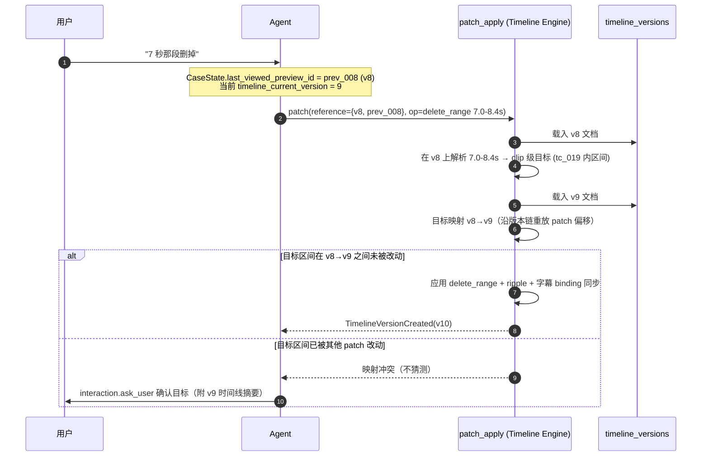

1. 自然语言时间引用一律先解析到 `reference.timeline_version`（默认 = last_viewed_preview 对应版本），因为那是用户"看到的"时间轴。
2. 锚版本上解析出 clip/utterance 级目标后再映射到当前版本应用。
3. 映射冲突 → 不猜测，转 ask_user。
4. `last_viewed_preview_id` 只在前端上报"用户实际播放过"（PreviewViewed 事件）后更新——渲染完成但用户没看不换锚。

### 7.9 DomainEvent / EventLog / Job / CostRecord

事件全集见 §4.5。库表结构见 §3.2 ER 图。补充硬规则：

- `event_log.event_id` 自增，同时是 SSE 回放游标（§13.2）。
- `jobs`：claim 语义见 §14.3；`(kind, idempotency_key)` 唯一索引防重复入队。
- `provider_calls`：每次 provider 调用由 Gateway 落一条（含 usage 与 cost_estimate）；Case Console 显示 Case 级汇总，Project 设置页显示 Project 级汇总。原始响应写 object store debug 目录，不进 CaseState。
- `messages`：对话历史表，`kind ∈ {user, reply, narration}`（Spec B 迁移新增列）——`user`=用户消息、`reply`=助手最终回复、`narration`=助手过程叙述（伴随工具调用产生，参与上下文回灌）；`role` 仍为 `user|assistant|system_observation`。历史经 `GET /cases/{cid}/messages`（升序，limit/cursor 简单分页）返回；turn 内实时增量走 turn-stream SSE（§2.6）。

> **（已删）7.10 CandidatePack** —— 离线检索基建整体移除（FTS/向量/RRF/candidate_pack）。选材主路径改为主代理读 MaterialSummary（§7.4）直接推理并用 `timeline.compose_initial` 组装，不再有中间候选包契约。

## 8. 素材沉淀与便宜索引

素材导入后自动进入 ingest 流水线（探测 → 代理 → **便宜本地索引**），秒级~十秒级即可用；理解按需、agentic（§4.11），不再有离线标注流水线。

### 8.1 Ingest 流水线

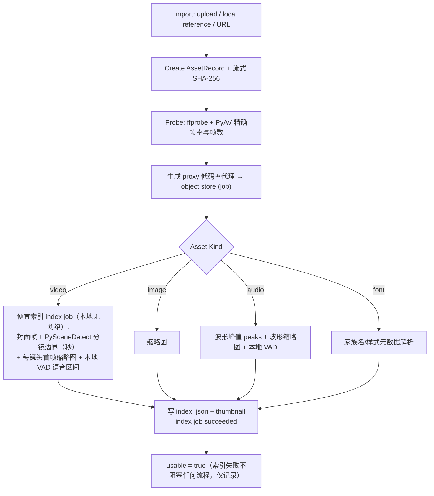

理解（看帧 VLM / 听音频 / 读索引 → MaterialSummary）不在 ingest 里跑，而是主代理需要时按需派子代理（§4.11）。ASR 也不在 ingest 强跑——口播粗剪或理解子代理需要时才触发 `asr.transcribe` 写 transcripts（§9）。

索引规则：便宜索引只产技术元数据 + 缩略图 + 分镜边界 + 波形/VAD，**不做质量判定**；画面质量好坏（模糊/抖动/过曝等）由理解子代理看帧后写进 MaterialSummary 的 `segments[].quality`（good/usable/avoid）。索引失败只记 `index_status=failed`，不阻塞任何流程；理解失败见 §4.11 失败语义（重试或经用户知情后绕过）。

### 8.2 理解按需分级（成本控制）

| 档位 | 触发 | 看帧密度 | 模型档位 | 产出 | 成本控制 |
|---|---|---|---|---|---|
| **首次理解** | 主代理调 `understand.materials`（无 focus） | 子代理按需自选时间点抽帧 | 多模态 profile（qwen-vl 系） | MaterialSummary v1：semantic_role、overall、带时间戳 segments（含 quality） | 只对被用到的素材；命中缓存不重算 |
| **focus 深挖** | 主代理带 `focus` 再调 | 针对 focus 关注点加密看帧 | 同上 | 带旧摘要增量深挖，version+1 | 只在需要更细信息时 |

Project 设置页显示累计理解/ASR 成本（来自 provider_calls，capability=vlm.understanding / asr.transcribe）。

## 9. 音频策略（云端 ASR 定稿）

### 9.1 六种音频模式（AudioMode 唯一 enum，定义于 contracts/case.py）

`AudioMode = keep_original | rough_cut | uploaded_voiceover | tts | silent | mixed`。**全文档、Decision 选项、audio_plan.mode、前置条件谓词一律使用此 enum 值**，不得使用长名变体。语义：`keep_original` 保留原声（可选降噪/响度标准化，须询问）· `rough_cut` 原声口播粗剪（口癖/停顿/重复句候选须确认）· `uploaded_voiceover` 上传配音（ASR + 对齐取时间戳）· `tts` 用户明确选择后才执行 · `silent` 无旁白按视觉节奏剪（后询问 BGM）· `mixed` 部分原声 + 旁白/BGM。**`mixed` 不是初始询问选项**：audio_mode Decision 初始只给五路径（§7.6 示例），`mixed` 是用户后续要求"保留部分原声再加旁白/BGM"时由 Agent 通过 AudioPlanUpdated 设置的派生模式。

**硬规则**：原素材有人声时，Agent 必须先 `audio.inspect_sources` 再询问音频模式，不得默认 TTS。

### 9.2 云端 ASR provider 契约

**决策**：ASR 不做本地部署（免去 Apple Silicon 部署负担——前期评审确认的最大部署风险）；经 ProviderGateway `asr.transcribe` capability 调云端；单用户量级按量计费成本可忽略。本地只保留 Silero VAD（260K 参数 ONNX，唯一本地模型）。

**Provider 硬性要求（descriptor 声明 + healthcheck 验证 + contract test）：**

1. `supports_word_timestamps=true`：字级（至少词级）时间戳。
2. `supports_raw_transcript=true`：**可关闭顺滑（disfluency removal）与 ITN，保留"呃/嗯/然后然后"口癖原文**。这是口播粗剪的生命线。Whisper 系因训练目标主动省略填充词且无法根治（faster-whisper 社区 #569/#901 确认），**OpenAI Whisper API 不得作为 rough_cut 场景 provider**。
3. 中文优先；配合本地 ffmpeg 抽轨转码 16k wav。

| 优先级 | provider | 说明 | 注意 |
|---|---|---|---|
| 默认 | 阿里云百炼 Paraformer-v2 录音文件识别 | FunASR 同源，中文第一梯队；官方支持关闭顺滑/ITN；字级时间戳 | adapter 显式关闭 disfluency/ITN；时间戳归一化到 ms |
| 备选 | 火山引擎大模型录音文件识别 | 可与 TTS 同账号；utterance+字级 | 文档字段不统一（start_time vs startTime），接入前必须控制台真实联调 |
| 备选 | 腾讯云录音文件识别 | 词级时间戳，语气词过滤可关 | 以真实响应为准 |
| 受限 | Whisper 系 | 省略口癖 | 仅允许"明确不需要口癖"的普通转写兜底 |

所有输出在 adapter 内归一化为 TranscriptDocument（§7.5）；contract test：固定含"呃"音频 fixture → 断言填充词保留 + 字级时间戳单调递增。

### 9.3 口播粗剪流水线

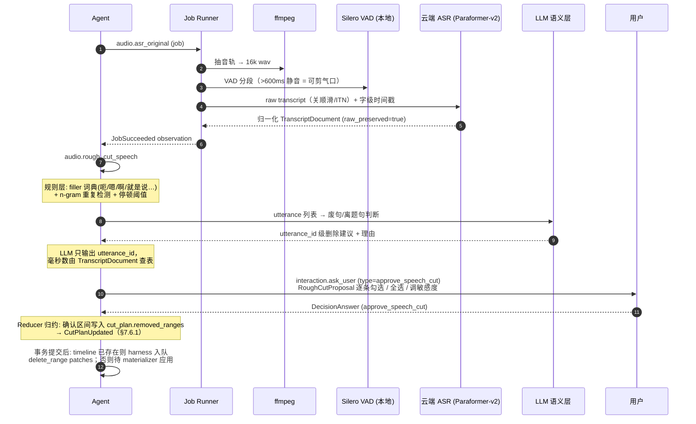

`RoughCutProposal` 条目：`{range_ms, kind: filler|pause|repeat|off_topic, confidence, transcript_excerpt}`。硬规则：**用户确认前 timeline 不删任何区间**；provider `raw_preserved=false` 时自动降级为"仅 VAD 停顿 + 重复句检测"，产生 `CapabilityDegraded` 事件并显式告知用户。

### 9.4 上传配音对齐

不引入独立 forced aligner。云端 ASR 转写配音（字级时间戳）→ 本地对 ASR 文本与用户脚本做动态规划对齐（编辑距离 + 锚定匹配段）→ 脚本句级时间戳。差异大的句子标 `alignment_confidence=low`，字幕生成时提示核对。对"照稿念"场景足够；不做音素级。

### 9.5 TTS 时间戳链路（火山引擎唯一）

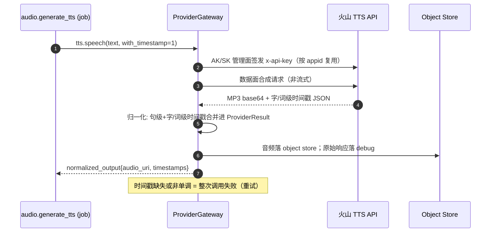

- 火山引擎是唯一 TTS 路线：仓库根 `.env` 提供 `RUSHES_VOLC_TTS_AKSK`（`AccessKeyId:SecretAccessKey`，SK 原样使用）、`RUSHES_VOLC_TTS_APPID`、`RUSHES_VOLC_TTS_CLUSTER`（`volcano_icl`）。
- 管理面：`speech_saas_prod` V4 签名调用 `ListAPIKeys`，不存在则 `CreateAPIKey`；数据面：`/api/v1/tts` 合成并要求返回可归一化时间戳。
- MiniMax 已被用户决策弃用，不作为默认、备选或 fallback。

## 10. Timeline Engine 与渲染契约

### 10.1 职责分工

LLM 只做语义选择（基于 MaterialSummary 给出 asset_id + 秒级 source 段落 + role、patch 意图）。Timeline Engine 负责帧级 materialize：把秒换算成帧、裁剪、拼接、补齐、ripple/lock policy 执行、字幕 binding 同步。**PyAV/ffprobe 提供精确帧率与总帧数作为基准**（不信容器头部近似 fps）。

### 10.2 Timeline 不变量（validator）

1. primary visual track 覆盖 `[0, duration_frames)` 无缝隙、无重叠。
2. 所有 clip 的 source 区间在素材实际帧数内（秒换算后落在 `[0, 素材帧数)`）。质量取舍（避开手抖/过曝段）在选材阶段由主代理依据 MaterialSummary 的 `segments[].quality` 完成，不再有 validator 层的 hard quality event 约束。
2b. timeline 引用的所有 asset 均 usable ∧ linked 到本 Project ∧ 未被本 Case 禁用（素材断链/reference 失效时 validate 必须失败，而不是渲染时才炸）。
3. 音轨 clip 不超时间线总长；字幕 clip 的 binding 目标存在。
4. fps 与 Project defaults 一致；所有区间半开且 start < end。
5. `validation_report` 随版本存档；`timeline_validated` 只由 validate 工具置位。

### 10.3 渲染架构（分段 + 缓存 + concat）

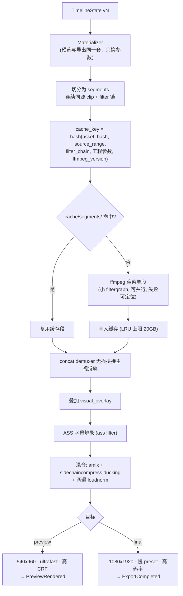

**硬规则：**

1. **禁止整条时间线一张巨型 filter_complex**（随机不可调试错误、跨版本行为漂移、转义地狱）。
2. **锁定 ffmpeg 版本**：`scripts/check_ffmpeg_version.py` 启动校验；版本进 cache_key。
3. **预览与导出复用同一 materializer**（所见即所得），只换编码参数。
4. 增量渲染即缓存命中：patch 只改某区间 → 只有该区间 segment 重渲。**失效保守规则**：多层叠加时间区间内任一层变动 → 该区间整个合成 stack 失效。
5. 渲染 job 从 ffmpeg `-progress` 管道解析进度 → JobProgress 事件 → SSE。
6. PyAV 只做探测/抽帧/缩略图；渲染管线全走 `asyncio.create_subprocess_exec` ffmpeg。
7. 少量转场（叠化）用 `xfade`/`acrossfade` 在相邻段边界单独处理，不做 AI 转场。

### 10.4 渲染缓存目录

`workspace/cache/segments/`：LRU + 容量上限（默认 20GB 可配）；不进 CAS 引用体系；可随时安全清空（仅导致下次全量重渲）。

## 11. 选材：主代理读摘要直接推理

离线检索基建（FTS5 / embedding / RRF / CandidatePack）**已整体删除**。选材主路径改为 agentic：

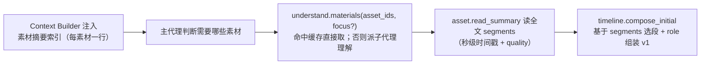

- **无向量库、无 FTS、无 RRF、无候选包**：主代理直接读 MaterialSummary 的 `segments`（含 description/quality/时间戳）推理选段，用秒级 source 段落调 `timeline.compose_initial`。
- 选材范围仍受作用域约束：当前 Project 已链接、usable、本 Case 未禁用；`selected_asset_ids` 非空时优先在其中选。
- 素材存活由 validator 保证（§10.2 第 2b 条：compose/validate/materialize 前重验 asset 仍 usable ∧ linked ∧ 未禁用），素材断链直接 validate 失败，不静默替换。

## 12. PolicyGate 规则清单（代码硬规则）

1. 用户意图不属于剪辑/素材管理/项目管理/导出/记忆沉淀 → 散文拒绝（仅输出 content 说明越界，不带工具调用，落 reply 并结束回合）。
2. 无 active_project 的剪辑请求 → 先创建/选择 Project；无 active_case → 先创建 Case。
3. 必须人工确认（统一经 §4.4 ask/PendingToolCall 机制，不作为暴露条件，**没有"直接拒绝"路径**）：Project 删除、Case 移动（`project.move_case`）、URL 导入、最终导出、字幕/BGM 新增 op（generate_subtitles/add_bgm，postprocess_plan 缺失时 ask 并暂存 patch）。**Case 删除/重命名/复制仅 UI/REST 确认**，不经 Agent。长期记忆的 gate 是 memory_scope decision（§4.4 例外条款）。确认 Decision 按 scope 挂在正确对象上，Project 级确认不得写入 CaseState。
4. `usable=false` 素材不得进入 timeline（validator 硬校验）；理解失败不阻塞剪辑，由主代理重试或经用户知情后绕过（§4.11）。
5. `render.final_mp4` 只接受 validator 通过的 timeline。
6. LLM 不得输出帧值、素材 source 定位、文件路径、ffmpeg 参数——LLM 可见 schema 中不存在这些字段，PolicyGate 对夹带做二次校验。用户时间引用（秒）仅允许出现在带 reference 锚的 TimelinePatchRequest 中（§7.8）。
7. case 级 blocking pending decision 存在时，白名单（§4.4）之外一律 deny；project/workspace 级 pending decision 不阻塞 Case loop，只阻塞自身 pending_tool_call。
8. 工具 failed 后，Agent 下一动作必须是解释错误（content 散文或 show_error），同一工具静默重试 ≤ 1 次。
9. 任何降级（provider fallback、raw_preserved=false、锚点映射失败转询问等）必须产生 `CapabilityDegraded` 事件，用户可见。
10. 每轮最多执行一个工具调用（tool_choice=auto，单步只取第一个 tool_call，多余的丢弃并记 trace）；并行工具调用禁用。

## 13. API 与前端接口

前端可直接调 REST，也可经 Agent 对话触发同样的工具；两路都产生 DomainEvent 走同一 Reducer。

### 13.0 本地安全基线（M0 交付）

仅绑定 `127.0.0.1` **不构成安全边界**：恶意网页可对 localhost 发起跨站请求（CSRF simple request / 表单提交 / DNS rebinding），而本 API 具备删除、导入、目录浏览、导出能力。基线四条（全部是启动即生效的硬规则，无用户配置）：

1. **启动随机 token**：进程启动生成一次性 token，通过启动 URL fragment 交给前端（`http://127.0.0.1:PORT/#t=<token>`，fragment 不进服务器日志）；前端存 sessionStorage，所有 API 请求带 `Authorization: Bearer <token>`；缺失或不符一律 401。SSE 用同 token（EventSource 场景经 query 参数，服务端校验后立即失效该参数的日志记录）。
2. **Host / Origin 校验**：仅接受 `Host: 127.0.0.1:PORT`（防 DNS rebinding——恶意域名解析到 127.0.0.1 时 Host 头不匹配即拒）；带 Origin 头的请求仅接受本应用 origin，其余 403。
3. **禁止 simple-request 变更**：所有 mutation 端点强制 `Content-Type: application/json`（表单/text-plain 类 simple request 直接 415），使跨站写操作必须过 CORS preflight，而 preflight 被 Origin 校验挡住。
4. **`/api/fs/*` 与路径入参加固**：所有用户提供路径先 `realpath` canonicalize（消解 `..`/符号链接），再校验位于 roots allowlist（默认 Home/Movies/Desktop/Volumes，可配置）之内；越界一律 403 且产生 `SecurityRefusal` 事件（§4.5）。`import-local` 与媒体流路由同样过此检查。

**SecurityRefusal 触发口径（统一）**：以上四条基线的**所有拒绝**——401（缺/错 token）、403（Host 不符 / Origin 不符 / 路径越界）、415（Content-Type 非 JSON）——一律产生 `SecurityRefusal` 事件（payload.reason ∈ {missing_token, bad_token, host_mismatch, origin_mismatch, path_escape, bad_content_type}），单机量级不存在写库压力，换来完整攻击证据链。

不做的部分（明确非目标，避免过度工程）：HTTPS/证书、多用户会话、细粒度权限——单机单用户场景下 token + Host/Origin + preflight 强制已封死浏览器侧攻击面；本机恶意进程不在威胁模型内（它本就能直接读写磁盘）。

### 13.1 REST 全集

```http
GET  /api/project-tree

POST /api/projects                     GET /api/projects
GET|PATCH|DELETE /api/projects/{pid}   POST /api/projects/{pid}/copy
POST /api/projects/{pid}/cases

GET  /api/projects/{pid}/materials
POST /api/projects/{pid}/materials/import-local      # reference 导入（UI 原生选择 + agent/REST 共用）：{path?|paths?}，目录递归保留 rel_dir，跳过项进 skipped
POST /api/fs/pick                                     # 弹宿主机原生选择框（macOS），返回绝对路径；不可用时 available=false
POST /api/projects/{pid}/materials/import-url        # 创建 url_import decision（对话/agent 链路，无 UI 入口）
POST /api/projects/{pid}/materials/link|unlink
PATCH /api/projects/{pid}/materials/{aid}

GET|PATCH|DELETE /api/projects/{pid}/cases/{cid}
POST /api/projects/{pid}/cases/{cid}/copy|move
POST /api/projects/{pid}/cases/{cid}/messages         # 入 Turn Queue
GET  /api/projects/{pid}/cases/{cid}/messages         # 消息历史（user/reply/narration，升序，limit 分页，§7.9）
GET  /api/projects/{pid}/cases/{cid}/timeline
GET  /api/projects/{pid}/cases/{cid}/timeline/versions
POST /api/projects/{pid}/cases/{cid}/timeline/restore
POST /api/projects/{pid}/cases/{cid}/previews/{preview_id}/viewed   # 前端播放上报 → PreviewViewed
POST /api/projects/{pid}/cases/{cid}/export
GET  /api/projects/{pid}/cases/{cid}/costs

GET  /api/projects/{pid}/cases/{cid}/decisions/current    # case 级
GET  /api/projects/{pid}/decisions/pending                # project 级（素材页/Project 页确认）
POST /api/decisions/{did}/answer                          # 统一回答入口（任意 scope，服务端校验归属）

POST /api/projects/{pid}/cases/{cid}/assets/select|disable|clear-selection

POST /api/uploads/init                 # 拖拽导入与非 macOS 回退链路（分片上传 copy）
PUT  /api/uploads/{upload_id}/parts/{part_number}
POST /api/uploads/{upload_id}/complete
GET  /api/uploads/{upload_id}

POST /api/jobs/{job_id}/cancel
```

边界不变量：`materials/*` 改 Project 素材池；`cases/{cid}/assets/*` 只改该 Case 作用域，不反向修改素材池（StateValidator 强制）。

### 13.2 SSE 事件流与断线回放

```http
GET /api/projects/{pid}/cases/{cid}/events    # Case 级 SSE
GET /api/projects/{pid}/cases/{cid}/turn-stream    # turn 内瞬态过程 SSE（快照+实时，事件见 §2.6；不做 Last-Event-ID 续传）
GET /api/events                                # Workspace 级（树变更、全局 job 进度）
```

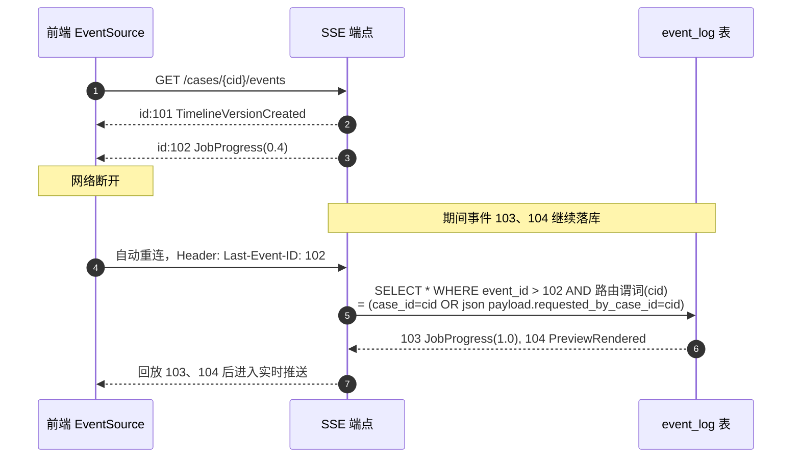

- 每条 SSE 的 `id:` = `event_log.event_id`；EventLog 本身就是回放缓冲，无需内存队列。**回放过滤与实时推送使用同一个 SSE 路由谓词**（§4.5 路由规则的代码化：Case 端点 = `case_id=cid OR payload.requested_by_case_id=cid`），禁止两处各写一份过滤逻辑。
- 实现：sse-starlette `EventSourceResponse`（FastAPI 0.135+ 内置 SSE 亦可）。不上 WebSocket（单向推送足够）。
- 前端原生 `EventSource`；TanStack Query 缓存以事件驱动失效。

### 13.3 媒体播放（HTTP Range）

```http
GET /api/media/{asset_id}/proxy          # 代理文件流, 206 Partial Content
GET /api/media/preview/{preview_id}
GET /api/media/export/{export_id}
GET /api/media/{asset_id}/thumbs/{n}
```

FastAPI FileResponse 原生支持 Range，播放器拖进度条秒开。前端上报播放事件 → `PreviewViewed` → 更新 `last_viewed_preview_id`（patch 锚点）。

### 13.4 原生选择、上传与目录浏览

**UI 导入主链路 = 原生对话框 + reference 原地导入**：`POST /api/fs/pick` 让后端（与用户同机）经 osascript 弹出 macOS NSOpenPanel（choose file/folder），返回所选**绝对路径**——这是浏览器沙箱之外拿到磁盘路径、实现零拷贝导入的唯一途径（File System Access API 只给内容句柄不给路径）。前端拿到路径后调 import-local reference 导入；目录递归展开时对每个文件重新 realpath canonicalize + fs_roots 校验（防符号链接逃逸），越界与不支持扩展名记入响应 `skipped` 不中断批量，项目内按 reference_path 去重。用户取消返回空 paths；非 macOS/无 GUI 会话返回 available=false。

**分片上传（init/parts/complete）为拖拽与回退链路**：拖拽（webkitGetAsEntry 递归目录）与非 macOS 回退的浏览器选择器拿不到磁盘路径，逐文件分片上传（copy 模式），complete 携带 `rel_dir`（文件夹相对路径，含所选目录名，POSIX 分隔）保留分组；不支持扩展名与隐藏项在前端过滤提示。

目录浏览 API 仅用于「重新定位失效素材」：

```http
GET /api/fs/roots                        # Home / Movies / Desktop / Volumes
GET /api/fs/list?path=/Users/me/Movies   # 子目录 + 媒体文件（按扩展名过滤）
```

只读；受 §13.0 全部基线约束（token + Host/Origin + realpath canonicalize + roots allowlist）。

## 14. 技术栈定稿（含取舍理由）

### 14.1 总清单

```text
Frontend
  React 19 + TypeScript + Vite
  TanStack Router          本地 SPA 路由（不用 Start——无需 SSR）
  TanStack Query           API/SSE 数据同步
  Zustand                  UI 状态（折叠、选中、播放器）
  Tailwind CSS v4          注意 @tailwindcss/postcss 拆包
  assistant-ui             聊天流 + Tool UI 渲染 StructuredInteractionEvent
  Vidstack                 预览播放器（封抽象层，Video.js v10 GA 后平滑迁移）
  自绘 SVG + wavesurfer.js  只读时间线 + 波形（不用第三方时间线编辑器）
  openapi-typescript       前端类型从 FastAPI OpenAPI 生成

Backend
  Python 3.12 + FastAPI + Pydantic v2 + uv
  SQLAlchemy 2 + Alembic（render_as_batch=True）
  SQLite WAL + JSON1（无 FTS5、无向量列；离线检索已删）
  sse-starlette

Worker / Runtime
  进程内 asyncio + SQLite jobs 表（自研约 200 行，claim 模式）
  ffmpeg/抽帧: asyncio.create_subprocess_exec（独立进程不占 GIL）
  云端 API: asyncio + Semaphore 限流
  双池: IO 池高并发；子进程池 ≤ 物理核数

Media
  ffmpeg / ffprobe（锁版本）  分段渲染 + hash 缓存 + concat；ASS 烧录；
                             sidechaincompress ducking；两遍 loudnorm
  PyAV                      精确探测 / 抽帧 / 缩略图（只读真相；理解子代理看帧复用）
  PySceneDetect             便宜索引分镜边界（秒）
  Silero VAD v6 (ONNX)      唯一本地模型（便宜索引语音区间 + ASR 前置）

Providers（全部经 ProviderGateway，OpenAI-compatible 第一类接口）
  llm.chat / vlm.understanding  OpenAI 兼容端点（任意厂商可配；vlm 供理解子代理看帧）
  asr.transcribe             云端: 阿里百炼 Paraformer-v2 默认；火山/腾讯备选
  tts.speech                 火山引擎唯一（字/词级时间戳）

Testing
  pytest + pytest-asyncio + Hypothesis（timeline/event 属性测试）
  Playwright（关键路由 E2E）
  Golden case 回放（mock ProviderGateway，M0 起）
```

### 14.2 明确不引入（负面清单 + 理由）

| 不引入 | 理由（2026-07 调研定稿） |
|---|---|
| LangGraph | checkpointer 抢状态真相源，与 CaseState 冲突 |
| smolagents | 执行器官方声明非安全边界 |
| Claude Agent SDK 作核心 | resume 依赖有损摘要；仅借 PreToolUse 语义 |
| LiteLLM proxy | 延迟、内存泄漏报告、2026-03 供应链投毒事件；单机治理功能用不到 |
| MLT / GES | Python binding 维护负债（SWIG 易碎 / 官方 disabled） |
| MoviePy 上生产 | 性能与确定性不足，仅可原型 |
| OTIO 作内部模型 | 交换格式定位，不校验不 materialize；仅未来导出 adapter |
| Temporal / Celery / arq / taskiq / dramatiq | 前者单机过度设计；后四者强依赖 Redis/RabbitMQ |
| LanceDB / Chroma | 离线向量检索已删（§11），无向量存储需求 |
| WebSocket | 单向推送 SSE 足够 |
| Electron | 多余中间层；未来分发用 Tauri v2 + Python sidecar |
| 本地 ASR（FunASR/Whisper 本地部署） | 云端 API 替代，免 Apple Silicon 部署负担 |

### 14.3 SQLite 写纪律与 Job claim（实现契约）

每连接 PRAGMA：`journal_mode=WAL; synchronous=NORMAL; busy_timeout=5000; foreign_keys=ON`。写事务 `BEGIN IMMEDIATE`（提前拿写锁快速失败）；事务要短（claim 即提交，结果另开事务写）；一连接一任务；WAL 只解决"读不挡写"，写路径单 writer 心态；aiosqlite 是线程包装非真异步，勿当高并发写通道。

```sql
-- claim（SQLite 无 SKIP LOCKED）
UPDATE jobs SET status='running', worker_id=:w, started_at=:t, heartbeat_at=:t
WHERE job_id = (SELECT job_id FROM jobs
                WHERE status='pending' AND next_run_at <= :t
                ORDER BY created_at LIMIT 1)
  AND status='pending';
-- changes()==1 即抢到；运行期间 worker 定期更新 heartbeat_at
```

`next_run_at` 非空且默认 = created_at（JobEnqueued 时写入），保证新 job 立即可被 claim。

失败重试：attempts+1，指数退避写 next_run_at，超 max_retries 置 failed + JobFailed 事件。进程重启：worker 心跳超时的 running 重置 pending（幂等键保证安全）。`(kind, idempotency_key)` 唯一索引防重复入队。

### 14.4 前端组件映射

| PRD 概念 | 组件 |
|---|---|
| 两态壳顶栏 | `Shell/TopBar`（字标 / 面包屑 / 连接状态 / 导出），workspace SSE 连接态出自 `use_workspace_events` |
| Project/Case 增删改移 | `Shell/EntityActionDialog`（首页、项目详情、工作台共用） |
| Case 工作台消息流 | assistant-ui Thread（ExternalStoreRuntime 接自有消息模型 + SSE） |
| StructuredInteractionEvent | assistant-ui Tool UI / DataMessagePart 自定义渲染器（Decision 卡、进度条、时间线摘要卡、预览卡） |
| 素材面板 | `Materials/AssetsPanel`（文件夹分组网格，管理/试看两模式；fs/pick 原生对话框 reference 导入 + 拖拽/回退分片上传）+ `FsBrowserDialog`（仅失效重定位） |
| 预览播放器 | Vidstack 封装 `<PreviewPlayer>`；帧级定位 currentTime += 1/fps；播放上报 PreviewViewed |
| 时间线结构查看 | 自绘 SVG 轨道图（只读）+ wavesurfer.js 波形，共享时间坐标系；点击 clip 高亮对应消息 |
| 面板拖拽分隔 | `Shell/ResizeHandle`（聊天宽度 / 时间线高度，尺寸存 localStorage） |

## 15. 目录结构（定稿）

```text
apps/
  api/
    main.py  deps.py
    routes/  project_tree.py projects.py project_materials.py cases.py
             messages.py decisions.py uploads.py media.py fs_browse.py
             events.py costs.py jobs.py
  web/
    src/
      app/         router.tsx query_client.ts use_workspace_events.ts
      routes/      ProjectsOverview.tsx ProjectDetailPage.tsx
                   ProjectMaterialsPage.tsx CaseAgentConsole.tsx
      components/  Shell/ Console/ StructuredInteractionRenderer/
                   Materials/ TimelineViewer/ PreviewPlayer/
      api/         client.ts generated/        # openapi-typescript 输出
      state/       ui_store.ts
  worker/
    main.py job_runner.py job_registry.py heartbeat.py

packages/
  contracts/       # 稳定 schema 与枚举；零业务依赖
    workspace.py project.py case.py asset.py understanding.py transcript.py
    memory.py decision.py timeline.py patch.py subtitle.py
    tool.py tool_result.py provider.py events.py jobs.py costs.py
  domain/          # 业务不变量；不依赖 FastAPI/React/provider
    case_stage.py preconditions.py decision_effects.py subtitle_templates.py
  agent_harness/
    loop.py turn_queue.py context_builder.py policy_gate.py
    tool_router.py reducer.py state_validator.py trace.py compaction.py
    prompts/ planner_system.md
  tools/           # Agent 可见能力外壳；只返回 ToolResult + DomainEvents
    registry.py specs.py
    project/ asset/ understand/ interaction/ content/ audio/
    media_tools/ timeline_tools/ render_tools/ memory_tools/ builtin/
  providers/
    registry.py gateway.py capabilities.py cost.py tool_gateway.py
    openai_compatible/  llm.py vlm.py           # 无 embedding（检索已删）
    aliyun/             asr_paraformer.py
    volcengine/         asr.py tts.py
    tencent/            asr.py            # 可选
  media/           # 唯一媒体实现层（无独立 packages/render）
    probe.py vad.py shots.py thumbnails.py waveform.py font_meta.py  # 便宜索引原语
    concat.py segment_render.py render_cache.py invalidation.py
    preview.py final_mp4.py subtitles_ass.py audio_extract.py proxy.py
    align.py asr_upload.py rough_cut.py url_import.py
  timeline/
    engine.py materializer.py patch_apply.py anchor.py validator.py version_store.py
  storage/
    db.py migrations/ repositories/ object_store.py workspace_paths.py data_migrations.py
  events/
    event_log.py sse.py
# 已删：packages/annotation（离线标注流水线）、packages/indexing（FTS/向量/RRF/candidate_pack）

tests/
  contracts/ domain/ agent_harness/ tools/ tools/understand/ providers/
  media/ timeline/ storage/ api/ apps/ worker/ e2e/
  golden/          # golden case 回放用例（含 understand→compose_initial 主链路）

scripts/
  dev_api.sh dev_web.sh run_worker.sh
  check_contracts.py check_ffmpeg_version.py
  poc/             # M-1 产物：asr_contract.py e2e_cut.py tts_timestamps.py

pyproject.toml uv.lock package.json pnpm-lock.yaml
```

**依赖方向（单向，check_contracts.py 静态检查）：**

```mermaid
flowchart LR
  APPS["apps/api · apps/worker · apps/web"] --> HARNESS["packages/agent_harness<br/>(loop / tool_router / reducer)"]
  APPS --> TOOLS
  HARNESS --> TOOLS["packages/tools<br/>(registry + handlers)"]
  HARNESS -->|"Reducer/EventLog/Trace 写路径"| IMPL
  TOOLS --> IMPL["packages/media · timeline<br/>providers · storage · events"]
  HARNESS --> DOMAIN["packages/domain"]
  TOOLS --> DOMAIN
  IMPL --> CONTRACTS["packages/contracts"]
  DOMAIN --> CONTRACTS
  CONTRACTS -.零依赖.-> NOTHING["不依赖任何业务实现/provider/DB/前端"]
```

方向澄清：**harness 依赖 tools**（tool_router 查 ToolRegistry 并调 handler），tools 不得反向 import harness——handler 与 harness 的通信只经 ToolResult/DomainEvent 数据结构（定义在 contracts）。**harness 也显式依赖 storage/events**（Reducer 是唯一写路径，直接使用 repositories 与 event_log；单机项目不做 ports 注入的过度抽象）。apps 可直接调 tools（UI 直接操作路径）也可经 harness（Agent 路径）。禁止任何形成环的 import；`check_contracts.py` 静态断言。

`apps/api` 不直接写 timeline、不直接调 ffmpeg、不 import 具体 provider。

## 16. 注册机制

### 16.1 ToolSpec

```python
class ToolSpec(BaseModel):
    name: str                                  # "understand.materials"
    namespace: str
    version: str
    status: Literal["stable", "experimental", "deprecated"] = "stable"
    input_model: type[BaseModel]
    result_model: type[BaseModel] | None
    handler_ref: str
    allowed_scopes: list[str]                  # project_material_page / case_agent_console
    requires_artifacts: list[str]              # §5.2 谓词名，如 ["timeline_exists", "timeline_validated"]
    requires_active_project: bool = True
    requires_active_case: bool = False
    requires_confirmation: bool = False
    confirmation_decision_type: str | None = None
    side_effects: list[Literal["project","case","asset","timeline","memory","object_store","job"]]
    idempotency_key_fields: list[str] = []
    emits_events: list[str]                    # 声明可产生的 DomainEvent 类型
    is_long_running: bool = False              # PolicyGate defer → job
    exposure: Literal["llm", "harness_only"] = "llm"   # harness_only 不进 allowed_tools（如 memory.save）
    description: str
```

**PatchOpSpec（op 级门控注册表）**：`timeline.apply_patch` 的 human gate 按 `op.kind` 分支，工具级的 `requires_confirmation` 表达不了。因此 patch op 也走注册表，PolicyGate 对 apply_patch 的裁决 = 查 `patch_op_registry[op.kind]`，是通用机制而非特判 if：

```python
class PatchOpSpec(BaseModel):
    kind: str                                   # "generate_subtitles"
    params_model: type[BaseModel]
    requires_confirmation: bool = False         # True → §4.4 ask+暂存
    confirmation_decision_type: str | None = None   # subtitle / bgm
    requires_artifacts: list[str] = []          # 如 ["rough_cut_approved"]
    ripple_semantics: Literal["ripple", "in_place", "n/a"] = "n/a"
    description: str

# 注册示例：generate_subtitles → requires_confirmation=True, decision_type="subtitle",
#           requires_artifacts=["rough_cut_approved"]
#           delete_range / edit_subtitle_text / adjust_gain → requires_confirmation=False
```

`ToolSpec.requires_confirmation` 对 `timeline.apply_patch` 本体恒为 False，op 级门控完全由 PatchOpSpec 承担；新增 op = params model + PatchOpSpec 注册 + materializer 实现 + 测试，不改 PolicyGate 代码。

ToolRouter 职责只有三件：按 name 查 registry、校验 input schema、执行 handler。**禁止 `if tool_name == ...` 分支**。同 namespace 允许多版本并存，Agent 默认只暴露 latest stable；experimental 需配置显式打开；破坏性变更注册新 version 并提供 migration。

### 16.2 ProviderDescriptor

```python
class ProviderDescriptor(BaseModel):
    provider_id: str
    display_name: str
    version: str
    capabilities: list[Literal[
        "llm.chat","vlm.understanding",
        "asr.transcribe","tts.speech","rerank.text",
    ]]
    config_model: type[BaseModel]
    client_ref: str
    healthcheck_ref: str | None = None
    supports_streaming: bool = False
    supports_json_schema: bool = False
    supports_word_timestamps: bool = False     # asr
    supports_raw_transcript: bool = False      # asr: 可关顺滑/ITN 保留口癖
    supports_native_timestamps: bool = False   # tts
    local_only: bool = False
    priority: int = 100
    fallback_provider_ids: list[str] = []
```

Gateway 按 capability 分发；`rough_cut` 场景**只接受** `supports_raw_transcript=true` 的 ASR。ProviderResult 归一化：`provider_id / capability / request_id / model / latency_ms / usage / raw_ref / normalized_output / warnings / error`，同步写 provider_calls（§7.9）。

### 16.3 扩展流程（新工具 / 新 provider / 新 MaterialSummary 字段）

```mermaid
flowchart TB
  subgraph NT["新增工具"]
    T1["定义 input/output Pydantic schema"] --> T2["写 handler（返回 ToolResult+Events）"]
    T2 --> T3["声明/复用 preconditions 谓词"]
    T3 --> T4["tool_registry.register(ToolSpec)"]
    T4 --> T5["单元测试 + golden case"]
  end
  subgraph NP["新增 provider"]
    P1["新增 ProviderConfig schema"] --> P2["写 adapter 实现 capability 接口"]
    P2 --> P3["registry 注册 descriptor"]
    P3 --> P4["healthcheck + contract test<br/>(ASR: 口癖 fixture 断言)"]
    P4 --> P5["特殊字段只在 adapter 内归一化"]
  end
  subgraph NA["新增 MaterialSummary 字段"]
    A1["在 understanding.py 加/改 Pydantic 字段 + 默认值"] --> A2["更新子代理 emit_summary 校验与 system prompt"]
    A2 --> A3["旧版本 summary_json 读取兼容（缺字段用默认）"]
    A3 --> A4["测试 fixture + golden 覆盖"]
  end
  NT -.不改主循环/状态机.-> OK["零侵入扩展"]
  NP -.业务代码不 import SDK.-> OK
  NA -.旧摘要可读/不炸.-> OK
```

**可扩展性验收（Gherkin）：**

```gherkin
Scenario: 新工具只通过 registry 暴露
  Given 开发者新增 tool handler
  When ToolRegistry 启动加载
  Then registry 中包含该 ToolSpec
  And ToolRouter 不需要新增 if/else 分支
  And PolicyGate 能读取该工具的 requires_artifacts 与 side_effects

Scenario: 新 provider 通过 capability 接入
  Given 开发者新增一个 tts provider
  When ProviderRegistry 启动加载
  Then capability = tts.speech 可发现该 provider
  And ProviderGateway 返回规范化 ProviderResult
  And audio.generate_tts 不 import 该 provider SDK

Scenario: 新 MaterialSummary 字段不破坏旧数据
  Given 已存在 material_summaries 里的旧版 summary_json
  When MaterialSummary 新增一个可选字段
  Then 旧 summary_json 可读取
  And 缺失字段使用默认值
  And asset.read_summary 不因旧版摘要缺字段失败
```

## 17. Milestones 与验收测试

```mermaid
flowchart LR
  M1N["M-1 POC<br/>媒体内核+云端契约"] --> M0["M0<br/>Contracts+Harness"]
  M0 --> M1["M1<br/>Tree+Project+Case"]
  M1 --> M2["M2<br/>素材+便宜索引"]
  M2 --> M3["M3<br/>Interaction+Decision"]
  M3 --> M4["M4<br/>音频+口播粗剪"]
  M4 --> M5["M5<br/>理解+Timeline"]
  M5 --> M6["M6<br/>预览+Patch"]
  M6 --> M7["M7<br/>后处理 Gate"]
  M7 --> M8["M8<br/>Memory"]
  M8 --> M9["M9<br/>端到端"]
```

### M-1：媒体内核与云端契约 POC（写 harness 之前）

不建 harness/UI，脚本或 notebook 验证三个最大风险；产物入库 `scripts/poc/` + 各一页结论。

1. **云端 ASR 契约**（`poc/asr_contract.py`）：真实口播视频（含"呃"、停顿、重复句）跑阿里 Paraformer-v2 与火山，断言：口癖保留、字级时间戳误差 < 100ms、与 Silero VAD 停顿互补可用；真实响应样本存 `research/asr_samples/`。
2. **端到端画质假设**（`poc/e2e_cut.py`）：VLM 理解一批真实素材产出带时间戳摘要 → 脚本据摘要拼一条 30s 竖屏 timeline → 分段渲染 + concat 导出 → 人工评估"能不能看"。**这是整个产品假设的核心，必须最早验证。**
3. **火山 TTS 时间戳链路**（`poc/tts_timestamps.py`）：管理面签发数据面 key、合成 MP3、解析并归一化字/词级时间戳跑通。

### M0：Contracts 与 Harness 骨架

交付：contracts 全量；Turn Queue；Context Builder（固定预算版）；原生 tool calling + tool_choice=auto（content 和/或 tool_call，单步单工具）；PolicyGate 双向；ToolRouter；Reducer + Validator；EventLog + SSE 回放；AgentTrace + golden 回放框架 + 前 3 个 golden case。

```gherkin
Scenario: 未注册工具被拒绝
  When LLM 返回 tool_name = "shell.exec"
  Then PolicyGate deny，产生 PolicyRefusal 事件，状态不变

Scenario: 严格类事件版本过期不能写入
  Given CaseState.state_version = 10
  When 严格类事件（如 TimelineVersionCreated）携带 base_version = 9
  Then Reducer 拒绝并记录 version_conflict

Scenario: 合并类事件不受版本推进影响
  Given render job 启动时 state_version = 10
  And job 运行期间用户消息使 state_version 推进到 12
  When PreviewRendered(timeline_version=8, base_version=null) 到达
  Then Reducer 正常记录 preview 行
  And 仅当 timeline_current_version 仍为 8 时更新 preview_current_id
  And 不产生 version_conflict

Scenario: ask 机制暂存并重放工具调用
  Given Agent 调用 project.delete 且无 answered confirm decision
  Then PolicyGate 裁决 ask，工具不执行
  And 创建 scope_type=project 的 confirm Decision，pending_tool_call 已存
  When 用户确认
  Then harness 自动重放 pending_tool_call 且执行成功
  When Agent 换参数重发同名工具
  Then 参数指纹不匹配，重新走 ask

Scenario: 安全基线（§13.0）
  When 不带 Authorization token 调用 POST /api/projects
  Then 返回 401 并产生 SecurityRefusal(reason=missing_token)
  When 携带错误 token 调用 POST /api/projects
  Then 返回 401 并产生 SecurityRefusal(reason=bad_token)
  When 请求带非本应用 Origin 头
  Then 返回 403 并产生 SecurityRefusal(reason=origin_mismatch)
  When mutation 请求 Content-Type = text/plain
  Then 返回 415 并产生 SecurityRefusal(reason=bad_content_type)
  When Host 头不是 127.0.0.1:PORT
  Then 返回 403 并产生 SecurityRefusal(reason=host_mismatch)
  When GET /api/fs/list?path=/etc/passwd 或含 ../ 的路径
  Then canonicalize 后越出 roots allowlist，返回 403 并产生 SecurityRefusal(reason=path_escape)

Scenario: pending decision 收窄 allowed_tools
  Given pending_decision_id != null
  Then 本轮 tools 只含 decision.answer / inspect / interaction 取消类（散文回复不占工具、恒可用）
  And render.final_mp4 不在 tools 列表

Scenario: 非法输出重试上限
  When LLM 连续 3 次输出被 deny 的动作
  Then harness 强制写 reply 解释卡点并结束回合（TurnEnded）

Scenario: SSE 断线回放
  Given 客户端断线期间产生事件 103、104
  When 客户端携带 Last-Event-ID: 102 重连
  Then 服务端按序补发 103、104 后进入实时推送
```

### M1：Project Tree、Project 页面与 Case 生命周期

交付：文件树（只显示 Project/Case）；Project 创建/重命名/删除/复制；Case 创建/重命名/删除/移动/复制；active 切换；Project 首页；Console 路由；tree API。

```gherkin
Scenario: 文件树只展示 Project 和 Case
  Given Project A 下有 Case 001、10 个 AssetRecord、2 条 ProjectMemory
  When GET /api/project-tree
  Then Project A 下只包含 Case 001，无 Assets/Memories 节点

Scenario: 点击 Project 打开 Project 首页
  When 用户点击 Project A
  Then 路由为 /projects/{projectA}
  And 页面有 新建剪辑 Case 与 素材管理 入口
  And 页面没有 Agent 对话输入框

Scenario: 从 Project 页面创建剪辑 Case
  When 用户点击 新建剪辑 Case 并输入 "剪一条 30 秒种草视频"
  Then 系统创建 Case（brief.goal 已记录）
  And 跳转 /projects/{pid}/cases/{cid}
  And Console 显示用户目标

Scenario: 进行中 Case 提出新任务必须询问
  Given 当前 Case 已有 timeline 且 rough_cut_approved = false
  When 用户说 "再剪一条新的 30 秒视频"
  Then Agent 调 interaction.ask_user（继续当前 / 新建 Case）

Scenario: 移动 Case 处理素材链接
  Given Case A 引用 Project 1 素材
  When 移动 Case A 到 Project 2 并确认
  Then Project 2.asset_links 包含相关 asset_id
```

### M2：素材管理与便宜索引（缩略图 + reference）

交付：素材页（缩略图/时长/理解状态徽标）；三类导入；probe + proxy；proxy 完成自动链入便宜 index job（分镜/波形/VAD/缩略图，本地无网络）；索引失败不阻塞；素材不进文件树。

```gherkin
Scenario: 素材页展示但文件树不展示
  Given Project A 已导入 asset_001
  Then /projects/{pid}/materials 展示 asset_001 状态
  And /api/project-tree 中 Project A 下无 asset_001

Scenario: 本地大文件 reference 导入不复制
  When 经目录浏览导入 /Movies/raw.mp4
  Then storage_mode = reference 且 object store 无源文件副本
  And proxy_object_uri 在代理生成后非空

Scenario: 源文件变更被检测
  Given reference 素材已导入
  When 源文件被外部修改
  Then 进素材页后 usable = false 且提示重新定位（AssetInvalidated 事件）

Scenario: 便宜索引失败不阻塞剪辑
  Given asset_001 的 index job 失败（index_status = failed）
  Then asset_001 仍 usable，可被主代理理解与剪辑
  And 素材页显示索引失败但不拦截后续流程

Scenario: URL 导入只下载该文件
  When asset.import_url 执行（decision 已确认）
  Then 只下载该 URL 指向文件，不抓取页面资源

Scenario: 上传后素材立即可用
  When 视频上传完成
  Then ~10s 内素材页出现缩略图与时长（index job 自动跑，无需手动触发）
  And 全程无 annotation 概念

Scenario: 理解按需触发且命中缓存
  When 主代理首次调 understand.materials(asset_001)
  Then 派子代理产出 ready MaterialSummary（understanding_status=ready）
  When 同素材无新 focus 再次被用到
  Then 命中缓存直接返回，不重复起子代理

Scenario: Case 选择素材不改素材池
  When 用户在 Case 001 指定只用 asset_001
  Then CaseState.selected_asset_ids = [asset_001]
  And Project asset_links 不变
```

### M3：Interaction 与 Decision Loop

交付：六个 interaction 工具；Decision API；自然语言回答归约；assistant-ui Tool UI 渲染。

```gherkin
Scenario: Agent 用工具提出音频模式问题
  Given Case 有可用视频且检测到人声
  When Agent 调 interaction.ask_user
  Then 创建 Decision.type = audio_mode
  And 前端渲染五个选项按钮

Scenario: 自然语言回答 decision
  Given pending Decision.type = subtitle
  When 用户说 "不要字幕，但是加个轻快 BGM"
  Then subtitle decision 归约为 skip_subtitle（answered_via = natural_language）
  And BGM 意图被记录（进入 BGM decision 或 brief）
```

### M4：音频模式与口播粗剪（云端 ASR）

```gherkin
Scenario: 有人声不默认 TTS
  Given Project 有带人声视频
  When 用户说 "剪成口播精简版"
  Then Agent 先 audio.inspect_sources 再 ask_user 五选项

Scenario: 口癖候选必须确认（approve_speech_cut）
  Given TranscriptDocument 含 "呃"、"然后然后"、>600ms 停顿
  When audio.rough_cut_speech 输出 RoughCutProposal
  Then 创建 pending decision（type = approve_speech_cut）
  And 用户确认前 timeline 无任何删除
  And 确认后归约进 cut_plan.removed_ranges，rough_cut_approved 保持 false

Scenario: raw transcript 不可用时降级
  Given ASR provider supports_raw_transcript = false
  Then rough_cut 只输出 pause/repeat 候选
  And 用户收到口癖识别不可用提示 + CapabilityDegraded 事件

Scenario: ASR contract test
  Given 含 "呃" 的 fixture 音频
  When 经 aliyun_paraformer_v2 adapter 转写
  Then TranscriptDocument 保留 "呃"（type=filler）
  And words 时间戳单调递增且 raw_preserved = true
```

### M5：理解 → 摘要 → Timeline 组装

```gherkin
Scenario: LLM 夹带裸帧被拒绝
  When tool call 参数包含 timeline_start_frame
  Then strict schema 校验失败，PolicyGate deny，原因回注

Scenario: primary track 不漏帧
  Given visual_base clips 覆盖 [0,100) 与 [120,300)，duration=300
  Then timeline.validate 返回 invalid，错误含 gap [100,120)
  And render.preview 不出现在 allowed_tools

Scenario: 主代理基于摘要组装初剪
  Given asset_001 已有 ready MaterialSummary（含 0-6s good 空镜段）
  When 主代理调 timeline.compose_initial（asset_001, 0.0-6.0s, role=a_roll）
  Then materializer 秒换帧组装 v1 并 validate 通过
  And TimelineVersionCreated + TimelineValidated 落库

Scenario: 理解失败可绕过不死锁
  Given asset_001 的 understand.materials 子代理超时（understanding_status=failed）
  Then 主代理拿到失败 observation，可重试或经用户知情后用其它素材继续
  And 不存在「理解失败不能剪辑」硬门

Scenario: reference 素材失效导致 validate 失败
  Given timeline 引用的 reference 素材源文件被外部删除
  When timeline.validate 执行
  Then 返回 invalid（asset 不再 usable），render.preview 不在 allowed_tools
```

### M6：预览与多轮 Patch（版本锚点 + 增量渲染）

```gherkin
Scenario: 删除 7 秒附近片段
  Given timeline fps = 30，用户刚看过 prev_008
  When 用户说 "7 秒那段删掉"
  Then 生成 delete_range patch（reference = {v8, prev_008}）
  And 应用后 primary track 仍无漏帧
  And 新版本 = 旧版本 + 1，字幕 binding 同步

Scenario: 锚点映射冲突转询问
  Given v8→v9 之间 7 秒附近已被改动
  Then patch 不应用，Agent ask_user 确认目标

Scenario: 增量渲染命中缓存
  Given v8 预览已渲染
  When patch 只改 [7.0,8.4)
  Then 未受影响 segment 命中 cache，重渲段数 < 全量

Scenario: 恢复历史版本
  Given timeline v8、v9 存在
  When 用户恢复 v8
  Then timeline_current_version = v8 内容（作为新版本 v10 记录）
  And preview 指向对应预览或触发重渲
```

### M7：后处理 Human Gate

```gherkin
Scenario: 粗剪确认后不能自动加字幕
  Given rough_cut_approved = true
  Then Agent 必须 ask_user 询问字幕
  And 未回答前 subtitles track 为空

Scenario: 有 audio 素材时 BGM 决策列出素材供选
  Given Project 已 link 至少一个 audio asset
  When 用户选择添加 BGM
  Then 选项为 已导入 audio 素材（按导入时间倒序，label 用文件名）/ 上传新的 BGM / 跳过

Scenario: 无 audio 素材时 BGM 决策仅两选项
  Given Project 无 audio asset
  When 用户选择添加 BGM
  Then 选项为 上传新的 BGM / 跳过

Scenario: 最终导出必须确认（ask 机制）
  Given final preview 已渲染
  When Agent 调 render.final_mp4 且无 answered export decision
  Then PolicyGate 裁决 ask，渲染不执行
  And 创建 export confirm Decision（pending_tool_call 已存）
  When 用户确认
  Then 自动重放并开始最终渲染

Scenario: 字幕写入 op 的 gate（ask 而非拒绝）
  Given rough_cut_approved = true 且 postprocess_plan.subtitle 为空
  When Agent 提交 generate_subtitles patch op
  Then PolicyGate 裁决 ask，patch 不执行
  And 自动创建 subtitle Decision（选项含样式模板与跳过），patch 存入 pending_tool_call
  When 用户选样式模板
  Then 归约进 postprocess_plan.subtitle 后重放该 patch
  When 用户选跳过
  Then pending_tool_call 置 discarded 且 postprocess_plan.subtitle = {enabled:false}
```

默认资产约束：字幕模板 ≤ 10 种（无许可证问题）；无内置 BGM 库，BGM 一律来自用户导入的 audio 素材；不做 AI 转场；只导出 MP4。

### M8：Memory Scope

```gherkin
Scenario: 保存经验必须选作用域（候选持久化）
  Given Case 已导出
  When 用户说 "把这次经验沉淀下来"
  Then memory.extract_from_case 写入 MEMORY_CANDIDATES（status=pending）
  And ask_scope 创建 memory_scope decision（引用 candidate_id）
  When 用户选 project 级
  Then memory.save(candidate_id, project) 落 MEMORIES 且候选置 saved
  When 用户选跳过
  Then 候选置 discarded，不产生 MEMORIES 记录

Scenario: project memory 不跨 Project 注入
  Given mem_project_001 属于 Project A
  When 用户在 Project B 创建 Case
  Then ContextBuilder 不注入 mem_project_001

Scenario: user memory 按相关性注入
  Given mem_user_001 为 user scope
  Then 任意 Project 的 Case 可按相关性注入其摘要
```

### M9：端到端三主路径（Playwright + 真实 provider 手动跑）

1. **原声口播粗剪**：导入带口播视频 → 检测原声 → 选粗剪 → 云端 ASR + 口癖候选 → 确认 → 粗剪预览 → "删 7 秒那段" → patch → 跳过字幕 BGM → 导出 MP4。
2. **TTS 种草**：无声 B-roll + 图 → 内容计划 → TTS（火山时间戳）→ understand.materials 理解素材 → compose_initial 组装 timeline → 预览 → 确认字幕 + BGM → 最终导出。
3. **Project/Case 管理**：建 Project → 导素材 → Case A 完成导出 → Case B 复用素材与 memory → Case B 移到新 Project 后仍可打开、素材链接正确。

## 18. 非目标（MVP 明确不做）

在线素材搜索 · AI 转场 · 团队协作/鉴权/多设备同步 · 云端发布 · 剪映草稿包 · 初级/高级用户分层 · 本地 ASR 部署 · 前端实时拼播预览（二期评估）· MP4 之外的导出格式。所有用户都可查看时间线结构，但主交互是 Agent Console。

## 19. 落地顺序与风险登记

### 19.1 落地顺序

```text
M-1 POC
→ contracts → Reducer/Validator → PolicyGate/ContextBuilder → ToolRouter
→ Turn Queue → AgentTrace/golden
→ Project/Case UI → Interaction Tools
→ Asset Import（reference/proxy）→ 便宜本地索引（ingest cheap pass）
→ Audio（云端 ASR）→ 素材理解（understand.materials 子代理）→ Timeline → Render（分段+缓存）
→ 后处理 → Memory
```

前七项完成后，Agent 已能像 Codex / Claude Code 一样在本地管理 Project、Case、提问和执行受控工具；剪辑能力逐步挂载，项目不会退化成藏在聊天框后的固定 workflow。

### 19.2 风险登记表

| # | 风险 | 等级 | 缓解 | 验证点 |
|---|---|---|---|---|
| R1 | VLM 理解摘要拼不出"能看"的片子（产品核心假设） | 高 | M-1 端到端 POC 最早验证；理解 prompt/看帧策略迭代 | M-1.2 |
| R2 | 云端 ASR 顺滑开关实际行为与文档不符 / 口癖仍被吞 | 高 | M-1 用真实响应验证；contract test 常驻；多 provider 备选 | M-1.1 / M4 |
| R3 | 火山 TTS/ASR 文档字段不一致 | 中 | M-1.3 先真实联调火山 TTS 数据面与时间戳字段；无 MiniMax fallback | M-1.3 |
| R4 | filter_complex 复杂化失控 | 中 | 分段渲染硬规则 + filtergraph builder 单元测试 + 锁版本 | M6 |
| R5 | patch 锚点映射实现复杂 | 中 | anchor.py 独立模块 + Hypothesis 属性测试（随机 patch 链上锚点解析不变量） | M6 |
| R6 | LLM 遵守"只给秒级 source 段落、不夹带帧/路径"的程度 | 中 | strict schema 层面不给帧字段 + PolicyGate 二次校验 + golden 回归 | M5 |
| R7 | SQLite 并发写冲突（job runner 与 API 同写） | 低 | §14.3 写纪律 + BEGIN IMMEDIATE + 短事务 | M0 起持续 |
| R8 | 成本失控（VLM/ASR 用量） | 低 | provider_calls 全量落库 + Project 预算暂停 | M2 |
| R9 | 上下文超预算导致 Agent 变笨 | 中 | Context Builder 预算表 + AgentTrace 记录 token 计数可观测 | M0 起持续 |
| R10 | assistant-ui / Vidstack 生态变动 | 低 | 都封抽象层；Video.js v10 GA 后评估迁移 | M3 / M6 |

---

*本文档为 v1.5 版，是本项目唯一实现依据。后续修订请递增版本号并在文首注明变更。*
